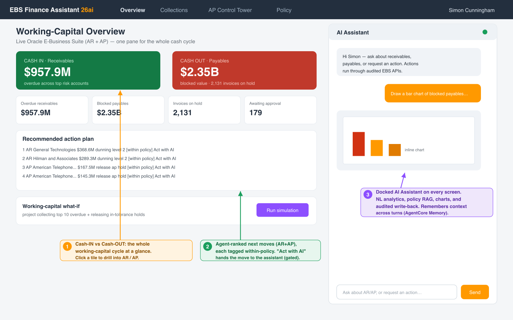
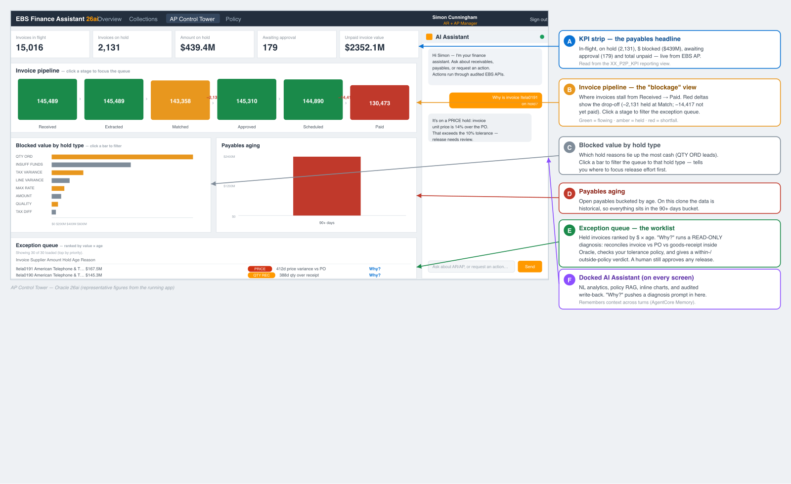

# EBS Finance Assistant (Oracle 26ai Edition) — Detailed Design Document

> **Status**: Living document — v0.5 (2026-07-01). Single detailed design for the whole solution.
> **Audience**: Engineers/architects who need to understand every part of the solution and
> reproduce it in their own AWS account, with or without the provided deployment scripts.
> **Scope**: one AI platform on Oracle Database 26ai spanning two finance workspaces —
> **Collections (AR / cash-flow)** and the **AP Control Tower (Purchase-to-Pay)** — sharing one
> three-layer architecture (deterministic reporting views + a Bedrock/Strands agent + audited
> EBS write-back), plus AI invoice ingest/extraction, VPD row-level security, and working-capital
> intelligence.
>
> **Document map:**
>
> - **Part I — Collections (AR / cash-flow):** the core platform — Oracle 26ai (non-Autonomous)
>   design decisions, SELECT AI, AI Vector Search/RAG, the React front end, the Strands agent on
>   Bedrock AgentCore, EBS write-back via ISG REST, the full deployment runbook, troubleshooting,
>   security, cost, and performance/scalability.
> - **Part II — AP Control Tower (Purchase-to-Pay):** the P2P extension — deterministic AP/PO/RCV
>   views, the match-and-resolve agent tools, invoice ingest/extraction, VPD, the "control tower"
>   dashboard, the working-capital intelligence layer, and the phased build status.
>
> Companion docs: `docs/SOLUTION_OVERVIEW.md` (architecture + live resource inventory),
> `docs/USER_GUIDE.md` (whole-system usage + test cases), `docs/UPGRADE_RUNBOOK.md`,
> `PROGRESS.md` (build log).

---

## Write-back capabilities — consolidated reference

Every mutation in the system is a **governed, audited action through a seeded/audited EBS API**:

- Never direct DML from the agent or a Lambda.
- Never through LLM-generated SQL (the NL→SQL path is read-only over curated views).
- The agent/UI validate the action, then call a **definer-rights APPS package over `oracledb`**, which invokes the underlying seeded EBS API.
- Risky actions are approval-gated and reversible where possible.

**Architecture of a write:** UI/agent tool → (WebSocket handler / Collections λ / P2P λ) →
`APPS.XX_*_PKG` (definer-rights, audited) → seeded EBS public API → EBS tables.

### Collections (AR) — `APPS.XX_COLLECTIONS_REST_PKG` (via `execute_collections_action`)
| Action | What it writes | Underlying EBS API | Gating / notes |
|---|---|---|---|
| `place_credit_hold` | Sets customer credit hold = Y | `HZ_CUSTOMER_PROFILE_V2PUB.update_customer_profile` | Reversible (verified on cust 1007) |
| `release_credit_hold` | Sets credit hold = N | `HZ_CUSTOMER_PROFILE_V2PUB.update_customer_profile` | Reversible |
| `create_collections_note` | Audited note on the account | Audited `APPS.XX_COLLECTIONS_NOTES` (JTF_NOTES-equivalent) | Autonomous txn; audit trail |
| `send_dunning_letter` | Dunning letter (status; SES email + text optional) | status response (+ optional SES / DBMS_CLOUD_AI text) | — |
| `send_payment_reminder` | Payment reminder (status; SES optional) | status response (+ optional SES) | — |
| `apply_order_holds` / `release_order_holds` | Order holds | `XxOrderHoldsPkg` (when deployed) | Returns "not available" until pkg deployed |
| `create_collections_task` | Follow-up task | `XxCollectionsTaskPkg` (when deployed) | Returns "not available" until pkg deployed |

> Transport: default path is the direct `oracledb` call to the audited package. `USE_ISG_REST_HTTP=1`
> switches to the HTTP ISG REST path (optional; the HTTP surface is stale on the clone).

### AP Control Tower (P2P) — `APPS.XX_P2P_AP_PKG` (via `execute_p2p_action`)
| Action | What it writes | Underlying EBS API | Gating / notes |
|---|---|---|---|
| `release_ap_hold` | Releases a named invoice hold | seeded `AP_HOLDS_PKG.RELEASE_SINGLE_HOLD` | **Approval-gated** + reason; reversible; no SOA Suite |
| `validate_invoice` | Re-runs AP validation (recomputes holds) | seeded AP validation | Audited |
| `create_ap_note` | Audited note on the invoice | audited note table | Autonomous txn |
| `manual_approve_invoice` | Sets status `MANUALLY APPROVED` | real EBS approval status | Gated on a reason; AME not configured on clone → manual status path |
| `propose_payment` | **Proposal only** — reports amount/due/holds/payable | none (no payment created) | Most-cautious; never selects or pays |

### AP invoice ingest + review — `APPS.XX_P2P_INGEST_PKG`
| Action | What it writes | Underlying EBS API | Gating / notes |
|---|---|---|---|
| `stage_invoice` | Stages extracted invoice; ≥threshold → AP interface, else NEEDS_REVIEW | seeded **Payables Open Interface** (`AP_INVOICES_INTERFACE` + lines) | Confidence gate + HITL |
| `approve_staged` (`p2p_approve_review`) | Approves a reviewed invoice (with optional corrections) → AP interface | `AP_INVOICES_INTERFACE` (+ lines) | Human review; optional field correction |
| `reject_staged` (`p2p_reject_review`) | Marks staging row `REJECTED` (never enters Payables) | staging table only (`XX_P2P_STAGING`) | Soft/audited; row retained |
| `submit_import` (`p2p_submit_import`) | Submits the import concurrent program | seeded **APXIIMPT** via `FND_REQUEST.SUBMIT_REQUEST` | Returns concurrent request id; APXIIMPT args instance-specific |

### Non-EBS writes (supporting)
- **S3 invoice inbox** — presigned PUT upload (UI) / SES→S3 → triggers the extract Lambda.
- **DynamoDB** — WebSocket connection tracking (`websocket-connections-26ai`).
- **CloudWatch** — agent interaction / audit logging.
- **Working-capital intelligence** (`XX_WORKING_CAPITAL_PKG`, `XX_P2P_ANOMALY_PKG`) — **read-only**
  analytics/anomaly checks; they never write EBS. Any resulting action routes through the gated APIs above.

**Governance guarantees:** least-privilege schema for reads; VPD row-level org scoping in the kernel;
all mutations via audited definer-rights packages → seeded EBS APIs; hold releases and anything
money-adjacent are approval-gated; payments are proposal-only. Full per-action detail: Part I §5.5
(Collections) and Part II §4/§5/§5.1 (P2P).

---

# Part I — Collections (AR / cash-flow)


> **Status**: Living document — v0.6 (2026-07-04). Updated as the build evolves.
> **Audience**: Engineers/architects who need to understand every part of the solution and
> reproduce it in their own AWS account, with or without the provided deployment scripts.
> **Scope**: Oracle Database 26ai (non-Autonomous) on EC2/ExaDB-D, ORDS REST surface, Oracle
> SELECT AI (DBMS_CLOUD_AI) on Amazon Bedrock, AI Vector Search, Amazon Bedrock AgentCore +
> Strands agent (with Code Interpreter), a **React** front-end, and Oracle E-Business Suite (EBS)
> write-back via ISG REST.

---

## 0. As-built status (deployed + verified 2026-06-30)

> The platform is **deployed and verified live** on the 26ai clone. Two designed paths were adjusted
> to match what the 23.26.2 build and the network topology actually support — both are noted here and
> inline. The design intent (in-DB SELECT AI + managed AgentCore Runtime) is retained as the target
> for environments that support it; an env switch / re-host flips back with no code rewrite.
>
> | Area | As designed | As built (verified) |
> |---|---|---|
> | NL→SQL | in-DB SELECT AI (`DBMS_CLOUD_AI.GENERATE`) | **agent boto3 Bedrock** → guard-railed SELECT → `oracledb`. In-DB SELECT AI fails on 23.26.2 (SigV4 scoped `s3://` → ORA-20401); profile stays configured, `USE_IN_DB_SELECT_AI=1` flips back |
> | Embeddings / RAG | in-DB ONNX (`all_MiniLM_L12_v2`) | **same — in-DB ONNX, 384-dim**, 9 docs embedded, COSINE search verified |
> | Agent runtime | managed Bedrock AgentCore Runtime | **Bedrock AgentCore Runtime** `ebs_collections_agent_26ai` — VPC-attached (reaches the private-subnet DB/EBS directly), SQLcl MCP + AgentCore Memory bundled; the sole agent host |
> | Dashboard data | ORDS REST + SELECT AI | **6 deterministic `XX_COLL_*_V` views** via the Collections Lambda over the WebSocket `dashboard` action (ORDS optional, not installed) |
> | Frontend | React (CloudFront+S3+Cognito+WebSocket) | **same — deployed**: https://d1vj6wa8y41whs.cloudfront.net |
> | Model | Claude Sonnet 4.5 | same — `us.anthropic.claude-sonnet-4-5-20250929-v1:0` |
>
> **Mandatory DB prereqs discovered post-upgrade** (now in section 6 / UPGRADE_RUNBOOK Stage 6): raise
> `COMPATIBLE>=23.0.0` + set `vector_memory_size` (enables the VECTOR datatype), and clear the FRA
> (post-upgrade archivelogs fill it and stall DBMS_VECTOR/ONNX ops).
>
> **Verified end-to-end:** agent NL→SQL → $1.1B live; KB → Disputed Invoices SOP; WebSocket
> dashboard → top risk customers ($368M/$289M); WebSocket chat → live markdown table. Deployed AWS
> resources are listed in SOLUTION_OVERVIEW.md.

---

## 1. Purpose and Background

This solution is a re-architecture of the AWS sample
[aws-samples/sample-ebs-ar-collections-agentic](https://github.com/aws-samples/sample-ebs-ar-collections-agentic).
The original used Amazon Redshift + Zero ETL to move EBS data out for analytics. This edition
replaces that data-movement pattern with **Oracle Database 26ai native AI** — querying live EBS
data directly with natural language using **Oracle SELECT AI**, and adding **AI Vector Search**
for retrieval-augmented generation (RAG). The conversational/orchestration layer remains an
agent built with the **Strands Agents SDK** on **Amazon Bedrock AgentCore**.

The business use case: a collections manager interacts in natural language to (a) analyse
accounts receivable (cash position, aging, risk) and (b) take collections actions (credit holds,
dunning letters, notes, tasks) — all from one conversation.

### Reference material
- Source repo: https://github.com/aws-samples/sample-ebs-ar-collections-agentic
- Oracle 26ai + Bedrock blog: https://aws.amazon.com/blogs/database/accelerate-generative-ai-use-cases-with-amazon-bedrock-and-oracle-databaseaws/
- Select AI providers (incl. AWS Bedrock): https://blogs.oracle.com/machinelearning/announcing-additional-ai-providers-for-oracle-autonomous-database-select-ai
- DBMS_CLOUD_AI reference: https://docs.oracle.com/en/database/oracle/oracle-database/26/arpls/dbms_cloud_ai1.html
- Strands Agents SDK: https://strandsagents.com/ and https://github.com/strands-agents/sdk-python

---

## 2. Key Design Decision: Autonomous vs Non-Autonomous

The single most important thing to understand before deploying: **the "managed AI" features of
Oracle 26ai (SELECT AI, the managed MCP server, Select AI Agent tools) are Autonomous Database
(ADB) features, not Exadata or database-version features.**

On a **non-Autonomous** Oracle 26ai database — whether on EC2 or Exadata Database Service
(ExaDB-D) on Oracle Database@AWS — these capabilities are **not pre-installed**. They must be
installed and configured manually. Running the same database version on EC2 vs ExaDB-D yields the
same feature availability; the Exadata advantage is runtime performance (AI Smart Scan offloads
vector operations to storage cells), not feature presence.

| Capability | Autonomous DB | Non-Autonomous (this build) |
|---|---|---|
| SELECT AI / DBMS_CLOUD_AI | Built-in | Manual install (documented below) |
| Managed MCP Server endpoint | Built-in (per-DB HTTPS) | Not available — run SQLcl MCP or custom MCP server |
| DBMS_CLOUD_AI_AGENT tools | Built-in | Installs with DBMS_CLOUD family |
| AI Vector Search (DBMS_VECTOR) | Built-in | Built-in (engine feature, present by default) |
| ORDS (REST endpoints for SELECT AI / KB) | Pre-provisioned | Manual install |

> Reference: Oracle AI Database Utilities Guide, *Installing DBMS_CLOUD* —
> https://docs.oracle.com/en/database/oracle/oracle-database/26/sutil/installing-dbms_cloud.html
> and MOS Doc 2748362.1 (How To Setup And Use DBMS_CLOUD Package).

---

## 3. Architecture Overview


The topology spans **two VPCs**:

- **Application / AI VPC** — the React UI (CloudFront + S3 + Cognito + WebSocket API), the WebSocket
  handler Lambda, the Collections / P2P / Extract Lambdas, and the Strands agent on **AgentCore
  Runtime** (with the SQLcl MCP server). Supporting services: Secrets Manager, Amazon SES, and Amazon
  Bedrock (Claude Sonnet 4.5 + AgentCore Code Interpreter).
- **EBS / Oracle VPC** — Oracle Database 26ai (CDB `CERPUAT`, PDB `ERPUAT`) holding the reporting
  views, in-DB ONNX vectors (AI Vector Search), VPD row security, and the audited APPS packages; and
  the EBS 12.2 application tier exposing ISG REST.

The two VPCs connect over the **ODB@AWS network**, so the agent reaches the private-subnet Oracle DB
(`oracledb`, 1521) and the EBS app tier (ISG REST, 8000) directly. The diagram above shows the full
topology.

### Two AI paths (by design)
1. **Agent path** (primary — conversation, analytics, and write-back orchestration): React chat →
   WebSocket → Strands agent on AgentCore Runtime. The agent reasons, runs NL→SQL analytics (today via
   Bedrock `converse`, guard-railed to a single read-only SELECT and executed with `oracledb`),
   performs EBS write-back through the audited APPS packages / ISG REST, does RAG via AI Vector Search,
   and renders charts via the AgentCore Code Interpreter.
2. **In-database SELECT AI path** (analytics, prerequisite-backed): a session calls
   `SELECT AI '<question>'` and Oracle 26ai turns it into SQL and runs it against **live** EBS tables
   with no data egress. On this reference clone the in-DB call to Bedrock hits a signer bug on 23.26.2,
   so the agent path above is the live analytics route today; it flips to fully in-DB with one env var
   once the DB patch lands.

Both paths share the same Bedrock backend and the same database.

---

## 4. Environment / Component Inventory

| Component | Identity (this deployment) | Notes |
|---|---|---|
| AWS account | 339712993582 | Default CLI creds (no profile). us-east-1. |
| EBS App node | EC2 `i-02239cc37bc522eb9` / 10.0.1.217 | ISG REST on :8000 |
| DB node | EC2 `i-07c5896f9cc2d90b6` / 10.0.1.244 | CDB CERPUAT, PDB ERPUAT |
| Database | Oracle AI Database 26ai EE 23.26.2.0.0 | Non-Autonomous |
| VPC / subnets | vpc-098f92e703bb04522 / subnet-06c6cba3d857fd556 (1a), subnet-040987ee7587270b9 (1b) | |
| Security group | sg-001d2d4f23b00dd36 (SAPSG01) | |
| ORDS | 26.1.2 | systemd service on :8080 — serves the SELECT AI / KB REST endpoints (not the UI) |
| APEX | 26.1.0 | Present in ERPUAT (ships with ORDS); **not** the product UI — the UI is React |
| Bedrock model | us.anthropic.claude-sonnet-4-5-20250929-v1:0 | Inference profile |
| IAM user (Bedrock cred) | ebs-collections-26ai-bedrock | Long-lived keys |
| CloudFormation stack | cash-flow-analytics-26ai | Separate from original deployment |

> **Isolation note**: Account 339712993582 also runs the original Redshift/Zero-ETL deployment.
> All 26ai resources use a `-26ai` suffix and a separate CFN stack so both can coexist.

---

## 5. Component Deep-Dives

### 5.1 Oracle SELECT AI (DBMS_CLOUD_AI)

SELECT AI translates natural language to SQL inside the database. You create an **AI profile**
that names a provider (here `aws` = Amazon Bedrock), a credential, a model, and an `object_list`
(the tables the model may use). You then call `SELECT AI '<prompt>'` or
`DBMS_CLOUD_AI.GENERATE(prompt=>..., action=>...)`.

`action` values:
- `showsql` — return the generated SQL only
- `runsql` — generate and execute, return rows
- `narrate` — execute and describe results in natural language
- `chat` — pass straight to the LLM (no SQL)

> Reference: https://docs.oracle.com/en/database/oracle/oracle-database/26/arpls/dbms_cloud_ai1.html

**Why it needs more than a profile on non-Autonomous:** DBMS_CLOUD makes an *outbound HTTPS* call to Bedrock. That requires:

- The DBMS_CLOUD packages owned by `C##CLOUD$SERVICE`.
- A network ACL allowing the call.
- An SSL wallet with CA certificates and the `SSL_WALLET` database property.
- A credential with **long-lived** AWS keys (temporary STS keys fail — no session-token field in a DBMS_CLOUD credential).

### 5.2 AI Vector Search (DBMS_VECTOR) + in-database embeddings (IMPLEMENTED)

Native to 26ai (present by default). Provides the `VECTOR` datatype, distance functions
(`VECTOR_DISTANCE(..., COSINE)`), and HNSW/IVF indexes. Used here for the collections knowledge
base (policies, SOPs, dunning templates) to give the agent and the React Policy library page RAG context.
> Reference: https://docs.oracle.com/en/database/oracle/oracle-database/26/vecse/

**Embedding provider — decision and rationale (verified live 2026-06-24):**
The SELECT AI path proves Bedrock egress works, but that path is **not reusable for embeddings**:

- `DBMS_VECTOR(_CHAIN).UTL_TO_EMBEDDING` has **no AWS/Bedrock provider** — supported values are
  `cohere`, `ocigenai`, `googleai`, `huggingface`, `openai`, `vertexai`, `mistralai`, `ollama`,
  `privateai`, and `database`.
  > https://docs.oracle.com/en/database/oracle/oracle-database/26/vecse/supported-third-party-provider-operations-and-endpoints.html
- `DBMS_CLOUD.SEND_REQUEST` only auto-signs **OCI and Azure** native APIs, so a direct SigV4 call
  to `bedrock-runtime…/invoke` for Titan embeddings returns **ORA-20403** (the AWS embeddings path
  is not signed for us). SELECT AI works only because `DBMS_CLOUD_AI` signs Bedrock internally.
  > https://docs.oracle.com/en/cloud/paas/autonomous-database/dedicated/adbaa/dbmscloud-rest-apis.html

➡️ **Chosen primary path = in-database ONNX embedding model** (`provider:"database"`). We load
Oracle's prebuilt, augmented **all_MiniLM_L12_v2** model (384-dim sentence transformer; tokenizer
+ pooling baked in) with `DBMS_VECTOR.LOAD_ONNX_MODEL` as `COLL_EMBED_MODEL` owned by
`COLLECTIONS_AI`. The **same** model embeds both stored documents and incoming queries, so they
share one vector space; retrieval is deterministic, has **zero network egress** at query time, and
no per-call cost. This is the correct posture for an *in-database* AI platform.
> Prebuilt model + load steps: https://blogs.oracle.com/machinelearning/use-our-prebuilt-onnx-model-now-available-for-embedding-generation-in-oracle-database-23ai
> UTL_TO_EMBEDDING (`provider:"database"`): https://docs.oracle.com/en/database/oracle/oracle-database/26/vecse/utl_to_embedding-and-utl_to_embeddings-dbms_vector_chain.html

**Implementation:**

- Table `COLLECTIONS_AI.COLLECTIONS_KNOWLEDGE_BASE(embedding VECTOR, content CLOB, summary,
  doc_type, metadata JSON, ...)`; 9 docs loaded + embedded in-DB. DDL:
  `collections_agent/sql/XX_KB_TABLE_SETUP_26ai.sql`; seed: `XX_KB_SEED_26ai.sql`; search package:
  `xx_kb_search_pkg.sql`. Source markdown for the docs lives in `knowledge_base/{policies,sops,templates}/`.
- Model load: `collections_agent/scripts/load_onnx_model.sh` (stages `all_MiniLM_L12_v2.onnx` from S3,
  loads `COLL_EMBED_MODEL`, embeds the 9 docs).

> **KB content is synthetic/illustrative** — authored for the demo (EBS has no seeded collections
> policy/SOP store); the `metadata.source` PDF citations are fabricated. Replace the thresholds with
> real policy for production. **Update path:** edit `XX_KB_SEED_26ai.sql` → `./deploy.sh database` →
> re-embed via `load_onnx_model.sh`; any changed `content` must be re-embedded (null `embedding` +
> re-run the embed step) or semantic search ranks stale text. The search package falls back to
> keyword match for un-embedded rows, so it never returns empty.
- Search API: `COLLECTIONS_AI.XX_KB_SEARCH_PKG.search(query, top_k)` — embeds the query with the
  in-DB model and ranks by `VECTOR_DISTANCE(..., COSINE)`. Auto-falls back to keyword token-overlap
  if the model/embeddings are not yet present, so the KB page always returns results.
- **Verified**: NL query *"how do I handle a customer disputing an invoice"* → Disputed Invoices
  SOP as top hit (COSINE similarity 0.58); *"payment plan for an overdue account"* → Payment Plan
  Setup SOP (0.71); *"final warning letter before legal action"* → Level 3 Final Notice (0.46).

**Alternative providers (swappable via the `PARAMS` JSON), documented for portability:**

- **OCI Generative AI** (`provider:"ocigenai"`, Cohere embed models) — managed, no in-DB model to
  maintain; natural choice on ODB@AWS where OCI GenAI is reachable.
- **Bedrock Titan via an external embedder** (the `knowledge_base/loader.py` boto3 path) — reuse if
  vector parity with a Bedrock-embedded corpus is required; emit the query vector outside the DB
  and pass it to `XX_KB_SEARCH_PKG.search_vec(:qvec)`.

**HNSW note:** the in-memory HNSW index needs `VECTOR_MEMORY_SIZE` allocated (init parameter,
requires restart). Until then, exact COSINE search runs without an index and is fine at this
corpus size. On Exadata, prefer **IVF_FLAT** for large corpora so AI Smart Scan offload applies
(see section 7A.1).

### 5.3 React front-end + ORDS REST surface

The product UI is a **React single-page app** (per the original design spec; APEX was evaluated and
dropped). It is served from S3 behind CloudFront, authenticates users via Amazon Cognito, and talks
to the AgentCore agent over the API Gateway **WebSocket** API for conversational chat. Deterministic
dashboard/KB data is read through **ORDS REST** endpoints (Oracle REST Data Services, a Java app
serving HTTP over the PDB). ORDS runs as a systemd service. (On this host the `oracle` OS user has
uid 65535 — the systemd overflow UID — so the unit runs the start script via `su - oracle` rather
than `User=oracle`.)
> ORDS docs: https://docs.oracle.com/en/database/oracle/oracle-rest-data-services/

The React app has four areas:

- **Dashboard** — cash / aging / risk via ORDS REST + SELECT AI.
- **Chat** — WebSocket → AgentCore.
- **Customer Details + action buttons** — write-back via the agent → ISG REST.
- **Knowledge Base search** — vector search via ORDS REST.

Charts are produced by the AgentCore **Code Interpreter** and streamed back to the UI.

### 5.3a SELECT AI REST API (ORDS) — UI-agnostic surface (IMPLEMENTED)

SELECT AI is published as ORDS REST endpoints so any client (React, curl, the Strands agent) can
consume natural-language analytics without embedding DB logic:
- `GET  /ords/collections_ai/ai/dashboard` — top-N overdue customers (live EBS via SELECT AI)
- `POST /ords/collections_ai/ai/ask` — body `{"q":"<question>","action":"runsql|showsql|narrate|chat"}`

Backed by `COLLECTIONS_AI.XX_SELECTAI_PKG` (thin wrapper over `DBMS_CLOUD_AI.GENERATE`). Created
via `ORDS.DEFINE_MODULE/TEMPLATE/HANDLER` (run connected as COLLECTIONS_AI so invoker rights
resolve). Scripts: `collections_agent/sql/xx_selectai_pkg.sql`,
`collections_agent/sql/ords_rest_endpoints.sql`.
> ORDS REST install requires `ORDS.ENABLE_SCHEMA` + `GRANT ORDS_ADMINISTRATOR_ROLE`.

### 5.3b MCP strategy (non-Autonomous) + access credentials

Because this is a **non-Autonomous** DB, there is no managed MCP endpoint and no
`DBMS_CLOUD_AI_AGENT` managed tools. The customer-managed pattern is used:
- **SQLcl 25.2+ MCP server** (`sql -mcp`) — **BUILT and agent-consumed** (DESIGN section 5.4,
  `agentcore_version/tools/sqlcl_mcp.py`). The Strands agent spawns `sql -mcp` as a local stdio
  subprocess and attaches its governed CONNECTIONS + SQL tools (connect, list-connections,
  run-sql, run-sqlcl). SQL runs under the COLLECTIONS_AI connection's read grants and is logged by
  SQLcl's MCP audit — it does **not** bypass the audited ISG-REST write-back path. Enabled with
  `USE_SQLCL_MCP=1` via the container image (`Dockerfile.sqlcl-mcp`, `deploy.sh agent-mcp`); off by
  default so the zip deploy is unchanged.
  Refs: https://docs.oracle.com/en/database/oracle/sql-developer-command-line/25.2/sqcug/starting-and-managing-sqlcl-mcp-server.html ·
  https://docs.oracle.com/en/database/oracle/sql-developer-command-line/25.2/sqcug/how-sqlcl-mcp-server-works.html
- **Custom MCP server** wrapping SELECT AI + DBMS_VECTOR search + ISG REST write-back so any MCP
  client (Strands agent, Kiro) can call them — the equivalent of the ADB-only
  `DBMS_CLOUD_AI_AGENT` tools.
  Refs: https://docs.oracle.com/en/database/oracle/oracle-database/26/arpls/dbms_cloud_ai_agent1.html ·
  https://docs.oracle.com/en/cloud/paas/autonomous-database/serverless/adbsb/getting-started-select-ai-agent.html

> **Security note**: these are non-production demo credentials for the cloned 26ai environment
> (account 339712993582, PDB ERPUAT). Rotate before any production hand-off. Nodes sit in private
> subnets; ORDS access is via an SSM port-forward to the DB node `i-0bb4baee0eb31d27f`.

| Context | Username | Password |
|---|---|---|
| EBS APPS / APPLSYS | APPS / APPLSYS | apps |
| APPLSYSPUB | APPLSYSPUB | &lt;set at deploy&gt; |
| DB admin (SYS/SYSTEM/EBS_SYSTEM) | SYS / SYSTEM / EBS_SYSTEM | &lt;set at deploy&gt; |
| WebLogic | | &lt;set at deploy&gt; |
| COLLECTIONS_AI app schema | COLLECTIONS_AI | &lt;set at deploy&gt; |
| ORDS/APEX gateway (serves the REST endpoints) | APEX_PUBLIC_USER | &lt;set at deploy&gt; |

> Passwords are set at deploy and held in AWS Secrets Manager; none are committed. Names only above.

### 5.4 Strands agent + Bedrock AgentCore

The agent (Python, Strands Agents SDK) exposes four `@tool` functions; the LLM (Claude Sonnet 4.5) decides which to call:

- `execute_oracle_ai_query` — NL→SQL analytics.
- `execute_collections_action` — ISG REST write-back.
- `search_knowledge_base` — vector search.
- `generate_chart` — Code Interpreter.

**As built (private-subnet topology):**

- The live UI chat runs on the **Amazon Bedrock AgentCore Runtime** (`ebs_collections_agent_26ai`), a VPC-attached container that reaches the private-subnet Oracle DB (1521), Bedrock, and ISG REST. AWS added **VPC connectivity to AgentCore Runtime**, so the managed runtime is the primary host; it also bundles the SQLcl 25.2 MCP server for governed in-browser SQL. Same `agent_strands.py` / `agentcore.yaml`.
- Invocation path: React → WebSocket → `ebs-collections-26ai-ws-handler` → AgentCore Runtime → tools.

**`execute_oracle_ai_query` as built:** does NL→SQL with **boto3 Bedrock** (`converse`, Sonnet 4.5)
against a curated EBS-AR schema/views prompt, guard-rails the output to a single read-only SELECT,
and executes it via `oracledb`. This is because in-DB `DBMS_CLOUD_AI.GENERATE` to Bedrock fails on
23.26.2 (SigV4 scoped `s3://` → ORA-20401). Set `USE_IN_DB_SELECT_AI=1` to switch back to in-DB
SELECT AI if a future DB RU fixes the signer — no other code change.
> Strands: https://strandsagents.com/docs/user-guide/quickstart/python/
> AgentCore: https://github.com/awslabs/amazon-bedrock-agentcore-samples

#### Concurrency + conversation continuity (fresh-Agent-per-request, history carried by the caller)

A Strands `Agent` is **stateful and single-flight**: by default it raises `ConcurrencyException`
("Agent is already processing a request. Concurrent invocations are not supported.") if invoked while
a prior call is still running, and it accumulates conversation history on the instance. The AgentCore
container serves **concurrent** HTTP invocations, and a chart request can run ~15–90s, so a shared
Agent would (a) reject or block a second in-flight message and (b) bleed one user's history into
another's. **Design:** the expensive tool list (incl. the SQLcl MCP JVM subprocess) is built **once**
and cached (`agent_strands.get_tools()`); `create_agent()` wraps those cached tools in a **fresh,
cheap `Agent` per request**, so every invocation gets its own concurrency controller and clean state.
The WebSocket handler also mints a **unique `runtimeSessionId` per request** so a slow call never
blocks the next one on the same browser connection.

That statelessness means multi-turn context (e.g. the user replying "2" to a numbered menu the agent
just offered) is **not** retained on the Agent instance. It is preserved by **two layers**, without
reintroducing a shared/sticky Agent:

1. **Amazon Bedrock AgentCore Memory (durable, server-side).** The runtime uses a short-term
   AgentCore Memory resource (`AGENTCORE_MEMORY_ID`) via `tools/agent_memory.py`. On each invoke it
   `get_last_k_turns(k=12)` to load recent turns, and after replying it `create_event(...)` to store
   the user+assistant turn (chart base64 stripped; `extraction_mode="SKIP"` = STM only). Crucially it
   is keyed **`actor_id = verified EBS username`, `session_id = WebSocket connectionId`** —
   **decoupled from the ephemeral `runtimeSessionId`**, so the unique-session-per-request concurrency
   design is untouched while memory still accumulates per user+connection and survives refresh/device.
   Fail-open: if Memory is unconfigured or errors, the agent still answers.
2. **Browser-carried history (fast-path fallback).** `AssistantDock` also sends the last ~12 turns
   (greeting skipped, inline chart base64 stripped) as `history` on the `sendMessage` payload. The
   runtime **merges** memory + browser turns (memory preferred, de-duplicated, capped at 12).

Either way, the merged turns are converted via `_history_to_messages()` into Strands pre-load messages
(`{"role":"user"|"assistant","content":[{"text":…}]}`), dropping any trailing user turn so history
ends on an assistant turn (the live prompt is the current user turn). Context is scoped to that user +
browser connection — no cross-user bleed — and token cost is bounded by the 12-turn cap. IAM: the
runtime role already carries the `bedrock-agentcore:CreateEvent/ListEvents/GetMemory/...` actions.

Also relevant to charts: `generate_chart` returns only a short `[[CHART:<token>]]` marker to the model
(the ~200KB base64 PNG is held in a runtime side-channel and substituted into the final reply by
`resolve_charts`), so a chart never floods the LLM context or triggers a retry loop.

### 5.5 EBS write-back via ISG REST

Collections actions (credit holds, notes, dunning, tasks) are custom PL/SQL packages on the EBS
app server, registered with the Integration Repository (iRep) and exposed as REST via the EBS
Integrated SOA Gateway (ISG) on port 8000. The Lambda (or agent) calls these endpoints.

### 5.6 Model Context Protocol (MCP) — current and future

Because this is non-Autonomous, there is **no managed MCP endpoint**. Three patterns apply — two
where the solution is an MCP *client* (consuming tools) and one where it is an MCP *server*
(publishing tools to Amazon Quick):

- **SQLcl MCP server** (`sql -mcp`, SQLcl 25.2+) — **implemented and consumed by the agent** as a
  runtime tool provider (`tools/sqlcl_mcp.py`, `get_sqlcl_mcp_tools()`). The agent spawns it as a
  co-located stdio subprocess inside the VPC agent container; SQLcl connects to the DB on 1521 with
  a saved connection built from the same Secrets Manager creds. Gated by `USE_SQLCL_MCP` (off by
  default; the container image bundles SQLcl + a JRE because it exceeds the zip-Lambda limit).

#### SQLcl MCP — security posture (for review)

The agent can *compose* SQL, but the **database is the hard security boundary** — the connection
it runs under cannot modify EBS data. Verified privileges of the `COLLECTIONS_AI` account SQLcl
connects as (live check, this clone):

| Concern | Answer |
|---|---|
| Direct DML on EBS (INSERT/UPDATE/DELETE) | **None.** Zero DML object grants on any EBS table. Worst case is a read it is already entitled to. |
| Object grants | 20 × SELECT + 1 × READ (read-only on the AR/AP views/tables) and 10 × EXECUTE (the audited seeded packages). |
| System privileges | Only self-schema DDL (`CREATE SESSION/TABLE/VIEW/PROCEDURE/SEQUENCE/TYPE/JOB/MINING MODEL`). **No `ANY` privileges, no DBA, no roles granted.** |
| Network exposure | None. `sql -mcp` is a co-located **stdio subprocess** inside the VPC container — not a listening service, no open port, no bastion. DB is in a private subnet. |
| DB authentication | Saved connection built at container start from **Secrets Manager** (KMS-encrypted); no hard-coded credentials. |
| Who can invoke | Behind **Cognito auth + server-verified JWT**; **write** actions are gated by the deterministic RBAC check (`authz.py`) that runs in code *before* any DB/EBS call — the LLM is never the security boundary. |
| Prompt-injection blast radius | Bounded by the DB grants above: injection cannot escalate privileges or write EBS data, because the grants (read-only + audited-package execute) are the ceiling. |
| Auditability | SQLcl MCP logs activity to a `SQLCL_MCP` log table; all EBS mutations flow through the audited seeded packages (definer-rights → EBS public APIs). |
| Write path (separate) | Writes never go through free-form SQL — only through `execute_collections_action` / `execute_p2p_action` → audited `APPS.XX_*_PKG` → EBS public APIs. |
| Enablement | Off by default (`USE_SQLCL_MCP`); read-scoped when on; does not bypass the audited write path. |

> **Hardening note:** `COLLECTIONS_AI` also holds `ADMINISTER DATABASE TRIGGER`, which is **not used
> by any shipped object** (no trigger DDL in the repo). Recommend revoking it to tighten least-privilege
> for customer deployments: `REVOKE ADMINISTER DATABASE TRIGGER FROM COLLECTIONS_AI;`

- **EBS Finance MCP server for Amazon Quick** (`agentcore_version/mcp_server.py`) — **implemented**.
  Here the solution is the MCP *server*: a FastMCP streamable-HTTP server hosted on a second
  AgentCore Runtime (`--protocol MCP`) that publishes a small set of governed ERP tools
  (`query_ebs_finance`, `search_finance_knowledge_base`, `get_ap_invoice_exceptions`,
  `get_working_capital_action_plan`, `predict_customer_payment`, `get_invoice_review_queue`,
  `create_ap_note`, `submit_invoice_to_inbox`). Amazon Quick registers this endpoint via its MCP
  client and can then run ERP analytics, push the action plan into an email/Slack digest, and turn
  emailed/Slack'd invoice attachments into EBS invoices (via the existing capture pipeline). The
  server is **decoupled from the Strands agent** — it does not import strands and calls the same
  audited PL/SQL packages / collections Lambda / S3 inbox, so the agent path is untouched. Auth is
  Cognito OAuth `client_credentials` (2LO): the CFN stack provisions a Cognito domain, resource
  server/scope (`ebs-finance-mcp/invoke`), and a confidential app client; AgentCore validates the
  JWT against the pool's OIDC discovery URL. **Deploy:** `./deploy.sh quick-mcp`. **Connect Quick:**
  a one-time console step (Quick is a licensed SaaS tenant with its own connectors/consent, so it
  cannot be provisioned by CloudFormation) — see `docs/QUICK_MCP_SETUP.md`. All writes stay on the
  audited seeded-API path; no tool pays or approves an invoice.

If the database is later migrated to Autonomous, swap the stdio SQLcl MCPClient for the managed
per-DB MCP endpoint (OAuth) and tools published via `DBMS_CLOUD_AI_AGENT`, with minimal agent code
change.
> SQLcl MCP: https://docs.oracle.com/en/database/oracle/sql-developer-command-line/25.2/sqcug/mcp-server.html
> Quick MCP integration: https://docs.aws.amazon.com/quicksuite/latest/userguide/mcp-integration.html

---

## 6. Deployment Runbook (reproduce in your own account)

This section is written so you can reproduce the build **manually** (without the scripts) or with
the provided `deploy.sh`. Commands assume Amazon Linux/RHEL on the DB node and AWS CLI v2 locally.

### 6.0 Prerequisites
- Oracle 26ai (23.26+) non-Autonomous DB, multitenant (CDB + at least one PDB).
- The DBMS_CLOUD install scripts present in `$ORACLE_HOME/rdbms/admin/` (shipped with 23.7+):
  `catclouduser.sql`, `dbms_cloud_install.sql`, `dbms_cloud_ai.sql`, etc.
- Outbound HTTPS egress from the DB host to `bedrock-runtime.<region>.amazonaws.com`.
- Amazon Bedrock model access (in commercial regions, FMs are enabled by default; pick a
  currently-active model — see 6.6). Ref:
  https://docs.aws.amazon.com/bedrock/latest/userguide/model-access.html
- SSM access to the DB/app nodes (this build drives everything over SSM `AWS-RunShellScript`).

> **SSM tip**: heredocs/`$`/`%` break the CLI parser. Build SQL locally, `base64` it, and decode
> on the host (`echo <b64> | base64 -d > /tmp/x.sql`). Run SQL as `su - oracle -c 'sqlplus ...'`
> which loads the Oracle env from `.bash_profile`.

### 6.1 Install DBMS_CLOUD (correct order is critical)

The packages **must** be owned by `C##CLOUD$SERVICE`. Run `catclouduser.sql` FIRST (creates the
schema), THEN `dbms_cloud_install.sql`. If you previously installed them under SYS, drop those
first (see 7.1).

```bash
# as oracle, from a clean state
$ORACLE_HOME/perl/bin/perl $ORACLE_HOME/rdbms/admin/catcon.pl \
  -u SYS/<syspw> --force_pdb_mode 'READ WRITE' \
  -b catclouduser -d $ORACLE_HOME/rdbms/admin -l /tmp/cu_log catclouduser.sql

$ORACLE_HOME/perl/bin/perl $ORACLE_HOME/rdbms/admin/catcon.pl \
  -u SYS/<syspw> --force_pdb_mode 'READ WRITE' \
  -b dbms_cloud_install -d $ORACLE_HOME/rdbms/admin -l /tmp/dci_log dbms_cloud_install.sql
```
Verify (in the PDB): `SELECT owner FROM dba_objects WHERE object_name='DBMS_CLOUD_AI';` → must be
`C##CLOUD$SERVICE`.
> Refs: Oracle Utilities Guide *Installing DBMS_CLOUD*
> https://docs.oracle.com/en/database/oracle/oracle-database/26/sutil/installing-dbms_cloud.html ;
> oracle-base walkthrough https://oracle-base.com/articles/21c/dbms_cloud-installation

### 6.2 Create the SSL wallet (for outbound HTTPS to Bedrock)

```bash
# as oracle
mkdir -p /fd01/ERPUAT/dbms_cloud_wallet
orapki wallet create -wallet /fd01/ERPUAT/dbms_cloud_wallet -pwd <walletpw> -auto_login
# add CA certs (split the OS bundle and add each)
csplit -z -f /tmp/ca- /etc/pki/tls/certs/ca-bundle.crt '/-----BEGIN CERTIFICATE-----/' '{*}'
for c in /tmp/ca-*; do
  orapki wallet add -wallet /fd01/ERPUAT/dbms_cloud_wallet -trusted_cert -cert "$c" -pwd <walletpw>
done
```
> The official MOS approach uses Oracle's `dbc_certs.tar`. Using the OS CA bundle works for public
> AWS endpoints. Ref: oracle-base "Create a Wallet" section (link above).

### 6.3 ACEs + SSL_WALLET property (run at CDB$ROOT)

```sql
ALTER SESSION SET CONTAINER=CDB$ROOT;
BEGIN
  DBMS_NETWORK_ACL_ADMIN.APPEND_HOST_ACE(
    host=>'*', lower_port=>443, upper_port=>443,
    ace=>xs$ace_type(privilege_list=>xs$name_list('http','http_proxy'),
                     principal_name=>'C##CLOUD$SERVICE', principal_type=>xs_acl.ptype_db));
  DBMS_NETWORK_ACL_ADMIN.APPEND_WALLET_ACE(
    wallet_path=>'file:/fd01/ERPUAT/dbms_cloud_wallet',
    ace=>xs$ace_type(privilege_list=>xs$name_list('use_client_certificates','use_passwords'),
                     principal_name=>'C##CLOUD$SERVICE', principal_type=>xs_acl.ptype_db));
END;
/
ALTER DATABASE PROPERTY SET ssl_wallet='file:/fd01/ERPUAT/dbms_cloud_wallet';
```

### 6.4 IAM user for the Bedrock credential (long-lived keys)

```bash
aws iam create-user --user-name ebs-collections-26ai-bedrock
aws iam put-user-policy --user-name ebs-collections-26ai-bedrock \
  --policy-name BedrockInvokePolicy --policy-document file://bedrock-policy.json   # bedrock:InvokeModel*, Converse*
aws iam create-access-key --user-name ebs-collections-26ai-bedrock
```
Temporary instance-role (STS) credentials will NOT work — DBMS_CLOUD credentials store only
access-key + secret (no session token).

### 6.5 Grant the app schema, create credential + profile

```sql
-- as SYS in the PDB
GRANT EXECUTE ON DBMS_CLOUD     TO COLLECTIONS_AI;
GRANT EXECUTE ON DBMS_CLOUD_AI  TO COLLECTIONS_AI;
GRANT CREATE CREDENTIAL         TO COLLECTIONS_AI;
GRANT SELECT ON AR.HZ_PARTIES, AR.HZ_CUST_ACCOUNTS, AR.AR_PAYMENT_SCHEDULES_ALL TO COLLECTIONS_AI;

-- as COLLECTIONS_AI
BEGIN
  DBMS_CLOUD.CREATE_CREDENTIAL(credential_name=>'AWS_BEDROCK_CRED',
    username=>'<AKIA...>', password=>'<secret>');
END;
/
BEGIN
  DBMS_CLOUD_AI.CREATE_PROFILE(profile_name=>'EBS_COLLECTIONS',
    attributes=>'{"provider":"aws","credential_name":"AWS_BEDROCK_CRED",
      "model":"us.anthropic.claude-sonnet-4-5-20250929-v1:0","comments":"true",
      "object_list":[{"owner":"AR","name":"HZ_PARTIES"},
                     {"owner":"AR","name":"HZ_CUST_ACCOUNTS"},
                     {"owner":"AR","name":"AR_PAYMENT_SCHEDULES_ALL"}]}');
END;
/
```
> Profile attribute reference (provider `aws`, `model`, `object_list`, `comments`):
> https://blogs.oracle.com/machinelearning/announcing-additional-ai-providers-for-oracle-autonomous-database-select-ai

### 6.6 Choose a currently-active Bedrock model

Claude 3.x are now **Legacy/EOL** (return `ResourceNotFoundException`). Verified-working options:
- `us.anthropic.claude-sonnet-4-5-20250929-v1:0` (best SQL generation — default)
- `us.anthropic.claude-haiku-4-5-20251001-v1:0` (faster/cheaper)
- `amazon.nova-pro-v1:0` / `amazon.nova-lite-v1:0` (no Marketplace/FTU; good chat, weaker SQL)

Check before use: `aws bedrock get-foundation-model-availability --model-id <id> --region us-east-1`
(want `authorizationStatus=AUTHORIZED`), then a tiny `invoke-model` to confirm it's not Legacy.
> Inference profiles (the `us.` prefix is required for cross-region models):
> https://docs.aws.amazon.com/bedrock/latest/userguide/inference-profiles-support.html

### 6.7 Test SELECT AI

```sql
-- as COLLECTIONS_AI
SELECT DBMS_CLOUD_AI.GENERATE(prompt=>'how many parties are there',
        profile_name=>'EBS_COLLECTIONS', action=>'runsql') FROM dual;
-- Expect a JSON row count, e.g. [ { "PARTY_COUNT": 40833 } ]
```

### 6.8 Install ORDS (REST surface) + SQLcl MCP server

```bash
# ORDS (Java 17 required) — REST surface for SELECT AI + KB, consumed by the React app + agent
yum install -y java-17-openjdk-devel
ords --config /opt/ords_config install --admin-user "SYS AS SYSDBA" \
  --db-hostname localhost --db-port 1521 --db-servicename erpuat \
  --gateway-mode proxied --password-stdin
# run ORDS via systemd (use su - oracle wrapper if oracle uid is the systemd overflow uid)
ords --config /opt/ords_config serve   # or the systemd unit

# enable the COLLECTIONS_AI schema for REST + deploy the SELECT AI / KB endpoints
sqlplus collections_ai/<DB_PASSWORD>@ERPUAT @collections_agent/sql/ords_rest_endpoints.sql

# SQLcl MCP server (non-Autonomous MCP path) — SQLcl 25.2+
sql -mcp        # exposes governed SQL tools over MCP, pointed at the PDB connection
```
> SQLcl MCP refs: https://docs.oracle.com/en/database/oracle/sql-developer-command-line/25.2/sqcug/starting-and-managing-sqlcl-mcp-server.html ·
> https://docs.oracle.com/en/database/oracle/sql-developer-command-line/25.2/sqcug/how-sqlcl-mcp-server-works.html

### 6.9 Deploy AWS infra + AgentCore agent + React UI (scripted path)

```bash
vi deploy-config.json          # set account, VPC, subnets, SG, IPs, model
./deploy.sh secrets infra lambda agent       # infra + Lambda + AgentCore (Strands) agent
./collections_agent/scripts/deploy_all_rest_services.sh   # ISG REST write-back on EBS app server
# build + sync the React UI to S3 (CloudFront + Cognito + WebSocket → AgentCore)
```

---

## 7. Troubleshooting (errors we actually hit, with fixes)

These are real errors encountered during this build and their root causes — invaluable for anyone
reproducing it.

### 7.1 `ORA-01435: user does not exist` on CREATE_PROFILE
- **Cause**: DBMS_CLOUD packages installed under SYS instead of `C##CLOUD$SERVICE` (happens if you
  install before the `C##CLOUD$SERVICE` user exists, or run `dbms_cloud_install.sql` without first
  running `catclouduser.sql`). The error stack will show `SYS.DBMS_CLOUD` instead of
  `C##CLOUD$SERVICE.DBMS_CLOUD`.
- **Fix**: Drop the SYS-owned packages and the user, then reinstall in the correct order:
  ```sql
  ALTER SESSION SET CONTAINER=ERPUAT;
  ALTER SESSION SET "_oracle_script"=true;     -- needed to drop oracle-maintained objects
  DROP PACKAGE SYS.DBMS_CLOUD_AI_AGENT; DROP PACKAGE SYS.DBMS_CLOUD_AI; DROP PACKAGE SYS.DBMS_CLOUD;
  -- at CDB$ROOT, with _oracle_script=true: DROP USER C##CLOUD$SERVICE CASCADE;
  ```
  Then run 6.1. Matches the (previously unsolved) Oracle forum thread "SELECT AI ACTIVATION ON
  ORACLE26AI": https://forums.oracle.com/ords/apexds/post/select-ai-activation-on-oracle26ai-7903

### 7.2 `ORA-20000: Database property SSL_WALLET not found`
- **Cause**: No SSL wallet configured for DBMS_CLOUD's outbound HTTPS.
- **Fix**: Create the wallet (6.2) and set the property at CDB$ROOT (6.3). The
  `ALTER DATABASE PROPERTY SET ssl_wallet=...` must run in the root container, not the PDB.

### 7.3 `ORA-20403: Authorization failed for URI - .../bedrock-runtime...`
- **Cause**: The Bedrock credential uses **temporary** STS keys (access key starts with `ASIA`).
  AWS SigV4 then fails because the session token is missing.
- **Fix**: Use a dedicated IAM user with long-lived keys (`AKIA` prefix). See 6.4.

### 7.4 `ORA-20404: Object not found - .../model/<id>/converse`
- **Cause**: The model isn't invocable — either Legacy/EOL or wrong ID/profile.
- **Fix**: Use a currently-active model and the correct inference-profile ID (6.6).
  `anthropic.claude-3-*` are Legacy; `us.anthropic.claude-sonnet-4-5-*` and Amazon Nova work.

### 7.5 SELECT AI returns `"could not be generated"` then uses a made-up table name
- **Cause**: The model invents a clean alias (e.g. `"Party"`) instead of the real table, or the
  app schema lacks SELECT on the underlying tables.
- **Fix**: Add table/column **comments**, set `"comments":"true"` in the profile, and `GRANT
  SELECT` on the real tables (e.g. `AR.HZ_PARTIES`) to the profile's schema. Reference tables in
  the prompt by their real names when in doubt.

### 7.6 ORDS systemd service fails with status `217/USER`
- **Cause**: The `oracle` OS user has uid 65535 (systemd overflow UID); systemd refuses
  `User=oracle`.
- **Fix**: Run the ORDS start script via `ExecStart=/bin/su - oracle -c '/opt/ords_start.sh'`.

### 7.7 Remote `sysdba` login fails: `ORA-01994 Password file is missing`
- **Cause**: `remote_login_passwordfile=EXCLUSIVE` but no password file on disk.
- **Fix**: `orapwd file=$ORACLE_HOME/dbs/orapw<SID> password=<pw> force=y` (password must not
  contain the word "sys"), then `ALTER USER SYS IDENTIFIED BY <pw> CONTAINER=ALL;`.

### 7.8 Anthropic First-Time-Use form rejected: "Internal Accounts should not submit use case details"
- **Cause**: Internal AWS accounts bypass the FTU flow; access is already granted.
- **Fix**: No action — just pick a currently-active model.

---

## 7A. Performance & Scalability: AI Smart Scan and Active Standby

This section addresses two questions enterprise customers always ask: *"Will running AI in my
database overload it?"* and *"Can we offload this to a standby so production OLTP is untouched?"*

### 7A.1 Exadata AI Smart Scan — why the database is not overloaded

When this solution runs on **Exadata** (ExaDB-D on Oracle Database@AWS, ExaDB-C@C, ExaCC, or
on-prem Exadata), Oracle 26ai AI Vector Search is automatically accelerated by **AI Smart Scan**,
introduced in Exadata System Software 24.1 and enhanced through 25.2/26.1. It is **automatic and
transparent — no code or query changes required.**
> Reference: [Exadata AI Smart Scan Deep Dive](https://blogs.oracle.com/exadata/post/exadata-ai-smart-scan-deep-dive)
> · [AI Smart Scan docs](https://docs.oracle.com/en/engineered-systems/exadata-database-machine/dbmso/ai-vector-search.html)
> · [Why Use Oracle AI Vector Search?](https://docs.oracle.com/en/database/oracle/oracle-database/26/vecse/why-use-vector-search-instead-other-vector-databases.html)

**How it protects the database tier (the customer-confidence story):**

1. **Processing is pushed DOWN to the storage servers, not run on the DB nodes.** Vector
   similarity is inherently scan-heavy (the closest *k* matches may require comparing against all
   vectors). AI Smart Scan offloads the `VECTOR_DISTANCE()` computation to the Exadata storage
   cells, so the DB-node CPU is freed for OLTP, analytics, and other work. Only results — not raw
   vectors — return to the DB node. This is the same offload philosophy that delivers up to
   500 GB/s analytic scan throughput per storage server on X11M.

2. **Massively parallel across storage cells.** The distance work is parallelized across all
   storage servers and tens-to-thousands of cores, so a single AI query does not monopolize the
   DB node. Result: up to **30x faster** vector queries (FLOAT32 baseline) vs non-offloaded.

3. **Adaptive Top-K Filtering (25.1+)** keeps a running top-k list per storage cell and returns
   only vectors closer than those already found — up to **4.7x less data** sent to the DB node,
   and the computed distance is projected back as a virtual column (avoids recompute; up to
   **24x less** data transferred). The DB node does minimal merge work.

4. **Vector format choices reduce footprint and load further:** INT8 (~4x smaller, up to 8x
   faster, >96% accuracy), BINARY (~32x smaller, up to 32x faster, >92% accuracy), SPARSE for
   keyword-style embeddings. Choosing INT8/BINARY shrinks memory/IO pressure on the DB tier.

5. **Included columns in IVF indexes** (23.7+) let relational predicates (e.g. price, ZIP, or in
   our case customer status / amount) be satisfied inside the index scan, eliminating extra
   single-block reads on the base table — up to 3x faster and less DB-node I/O.

**Design guidance for this solution:**

- Store knowledge-base embeddings as `VECTOR(1024, INT8)` (or BINARY for very large corpora) and
  build an **IVF_FLAT (Neighbor Partition) index** so AI Smart Scan offload applies. (HNSW is
  in-memory on the DB node and does not offload the same way; IVF_FLAT is the offload-friendly
  choice for large vector volumes on Exadata.)
- Use `INCLUDE (doc_type, ...)` on the vector index so metadata filtering avoids base-table I/O.
- The **SELECT AI** analytics path runs ordinary SQL against EBS tables — that SQL benefits from
  standard Exadata Smart Scan (predicate offload, column projection, storage indexes) exactly
  like any EBS report, so NL-driven analytics impose no more DB-node load than the equivalent
  hand-written query.

**On EC2 (non-Exadata):** AI Smart Scan does **not** apply (there are no storage cells to offload
to). Vector search still works correctly via HNSW/IVF indexes, but distance computation runs on
the DB-node CPU. For an MVP/demo this is fine; for production-scale vector volumes, Exadata
(ExaDB-D on ODB@AWS) is the recommended target precisely because of AI Smart Scan. **This is the
key architectural reason to run the production workload on ExaDB-D rather than EC2** — same
features, but the storage-offload performance/headroom is materially different at scale.

### 7A.2 Offloading to an Active Data Guard standby (Real-Time Query)

Customers who want **zero additional load on the production primary** can run the read-only AI
workload on an **Oracle Active Data Guard** standby using **Real-Time Query**. Each standby is a
full physical replica opened read-only; reads are offloaded there while the primary stays focused
on OLTP read/write.
> Reference: [Application and AI Scalability with Oracle Active Data Guard](https://blogs.oracle.com/maa/application-and-ai-scalability-with-oracle-active-data-guard)
> · [Data Guard product page (AI on standby)](https://www.oracle.com/database/data-guard/)

**What works on an Active Data Guard standby for this solution:**

- **SELECT AI analytics (read path)** — `SELECT AI '<question>'` with `action => runsql/showsql/
  narrate` is read-only SQL generation + execution, ideal for offload to the standby. The
  collections **dashboard and analytics** can run entirely against the standby.
- **AI Vector Search retrieval (RAG read path)** — vector similarity queries are read-only and
  offload cleanly. Oracle explicitly calls out end-to-end AI workflows (embedding generation →
  RAG → vector search) on standby.
- **DML Redirection handles the occasional write transparently.** If an operation on the standby
  needs to write (e.g. logging a chat turn, or inferencing that writes vectors/metadata back),
  Active Data Guard **transparently redirects the write to the primary** while the session still
  appears to execute on the standby, preserving ACID semantics. So any incidental chat-history /
  agent-log inserts still work from a standby-connected read session.

**What must stay on (or route to) the primary:**

- **DBMS_CLOUD / SELECT AI credential & profile creation** and any DBMS_CLOUD setup that writes
  metadata — do these on the primary; they replicate to the standby.
- **Knowledge-base ingestion / embedding writes** — corpus loads and embedding inserts are writes;
  run them on the primary (or rely on DML redirection for incidental writes).
- **EBS write-back actions** (credit holds, notes, dunning, tasks) — these are writes to EBS and
  go through ISG REST on the app tier → primary EBS database, independent of the standby.

**Reference architecture for "don't touch production" deployments:**
```
                       ┌────────────────────────┐        Redo apply
  Collections agent →  │  PRIMARY (OLTP + EBS)   │ ───────────────────────►  ┌─────────────────────────┐
  + EBS write-back     │  read/write             │ ◄───── DML redirect ───── │  ACTIVE STANDBY (read)  │
  (ISG REST)           └────────────────────────┘                            │  • SELECT AI analytics   │
                                                                              │  • Vector Search / RAG   │
  React UI / NL analytics ─────────────────────── Real-Time Query ─────────► │  • read-only sessions    │
                                                                              └─────────────────────────┘
```
- Point the **React UI / SELECT AI analytics** data source at the standby (Real-Time Query).
- Keep **write-back** on the primary path (ISG REST → primary).
- Use **Global Data Services (GDS)** as a single, location- and lag-aware entry point if there are
  multiple standbys, so the app doesn't hard-code standby connection strings and gets automatic
  routing, retries, and session draining.
- Optionally use **Oracle True Cache** (a consistent, in-memory read replica) for read-only vector
  retrieval offload without provisioning a full standby copy.
  > Reference: [Using Vectors with Oracle True Cache](https://blogs.oracle.com/database/using-vectors-with-oracle-true-cache)

**Important platform note:** *Autonomous* Data Guard standbys are **not** openable for read-only
query offload — that capability is specific to **(Active) Data Guard on non-Autonomous / Exadata
Database Service**. Since this solution targets a non-Autonomous 26ai database, the Active Data
Guard offload pattern is available; on Autonomous it would not be.
> Reference: [Autonomous Data Guard Notes](https://docs.oracle.com/en/cloud/paas/autonomous-database/serverless/adbsb/autonomous-data-guard-notes.html)

### 7A.3 Summary for customer conversations

| Concern | Answer |
|---|---|
| Will AI vector search overload my DB nodes? | On Exadata, no — AI Smart Scan offloads distance + top-k to storage cells; only results return. Up to 30x faster, dramatically less DB-node CPU/IO. |
| What about the NL→SQL analytics queries? | They are normal SQL and benefit from standard Exadata Smart Scan, same as any EBS report. |
| Can I keep all this off my production primary? | Yes — run the read-only SELECT AI + Vector Search on an Active Data Guard standby (Real-Time Query); DML redirection handles incidental writes; EBS write-back stays on the primary path. |
| EC2 vs ExaDB-D? | Features identical; Exadata adds AI Smart Scan storage offload, which is the production-scale performance/headroom argument. |
| Vector storage cost/perf? | Use INT8/BINARY formats + IVF_FLAT indexes with included columns to cut size and accelerate. |

---

## 8. Security Considerations

- **Least privilege**: `COLLECTIONS_AI` gets only `SELECT` on the specific EBS tables in the
  profile `object_list`. SELECT AI executes generated SQL as this user, so it cannot touch tables
  it has no grant on.
- **Credential storage**: AWS keys live in a DBMS_CLOUD credential (encrypted) and in AWS Secrets
  Manager for the Lambda/agent — never hard-coded. The IAM user is scoped to `bedrock:InvokeModel`
  + Marketplace subscribe only.
- **Network**: DB egress is restricted by the network ACL to the Bedrock host. The DB and app
  nodes sit in private subnets; ORDS/admin is reached via SSM port-forward (no public ingress).
- **Auditing**: agent interactions are logged via the WebSocket handler + AgentCore. DBMS_CLOUD_AI activity can be
  audited via Unified Auditing. EBS write-back is logged as notes/tasks in EBS.
- **Generated-SQL risk**: SELECT AI can run arbitrary generated SQL. Mitigate with least-privilege
  grants, read-only profiles for analytics, and review of write paths (write-back goes only
  through the curated ISG REST packages, never through SELECT AI).

### 8.1 Infrastructure security hardening (CloudFormation, as-deployed 2026-07-16)

The AWS stack (`frontend/infrastructure-26ai.yaml`) applies the following controls; all are defined
in the template so every deployment is consistent.

> **2026-07-16 additions (security-scan hardening):** the deploy **artifacts bucket** is now
> CloudFormation-managed (`ArtifactsBucket`, SSE-KMS + logging + versioning + PAB + SSL-only),
> replacing an unhardened `aws s3 mb`. The **WebSocket access-log group** and the **Lambda DLQ**
> (encrypted SQS, wired to all five functions with reserved concurrency) are KMS-encrypted with the
> CMK. CloudFront now pins **TLS 1.2** and is fronted by a **WAFv2 WebACL** (AWS common +
> known-bad-inputs / Log4Shell rule groups). WebSocket **access logging** is configured on the stage.
> The AgentCore container images run **non-root with a HEALTHCHECK**. So "three buckets" below is now
> **four** (frontend, logging, invoice inbox, artifacts).

- **Encryption at rest — customer-managed KMS key.** A CMK (`alias/ebs-collections-26ai`, automatic
  annual rotation) encrypts the **P2P invoice inbox** (SSE-KMS — sensitive documents), the
  **DynamoDB** connections table (SSE-KMS), and **all five Lambdas' environment variables**
  (`KmsKeyArn`). The key policy grants the account root plus the consuming services (S3, DynamoDB,
  Lambda, CloudWatch Logs); each role that touches an encrypted resource is granted only
  `kms:Decrypt` / `kms:GenerateDataKey` on that one key.
  - **Deliberate exception (documented):** the **Frontend** and **Logging** buckets use **SSE-S3
    (AES256), not KMS**. The frontend bucket is served through a CloudFront **Origin Access
    Identity**, and SSE-KMS objects cannot be delivered via a legacy OAI (that would require
    migrating to Origin Access Control). The logging bucket is the S3 **access-log destination**,
    and log delivery (S3 server access logs / CloudFront logs) does not support an SSE-KMS
    destination. AES256 is the correct at-rest posture for both.
- **S3 hardening.** All three buckets: default encryption, `PublicAccessBlock` (all four flags),
  versioning, and an SSL-only bucket policy (`Deny` when `aws:SecureTransport=false`). **Server
  access logging** is enabled on the frontend bucket (prefix `s3-frontend/`) and the invoice inbox
  (prefix `s3-inbox/`), both delivered to the central logging bucket (90-day lifecycle). CloudFront
  access logs also land in the logging bucket.
- **All Lambdas in the VPC.** All five functions (collections, P2P read, P2P extract, agent runtime,
  WebSocket handler) run in the same private subnets and security group — no public data path. The
  WebSocket handler reaches API Gateway `ManageConnections` and DynamoDB from within the VPC
  (verified live). DynamoDB also has **point-in-time recovery** enabled.
- **DynamoDB** SSE-KMS + PITR; **API Gateway WebSocket** default-route throttling (burst 50 /
  rate 25). *Note:* WebSocket stage access logging requires an account-level API Gateway CloudWatch
  Logs role (a global account setting outside this stack); the handler Lambda emits full CloudWatch
  logs, so request auditing is covered regardless.
- **Presigned uploads unaffected by KMS.** The browser/Quick presigned `PutObject` uses only
  Bucket+Key, so S3 applies the bucket's default KMS encryption automatically — no client-side SSE
  header is required and the upload flow is unchanged.

### 8.2 Identity & role-based access control (RBAC) — as-built + roadmap

The agent can *act* on EBS, so **who is allowed to do what** matters as much as what it can do. The
design enforces the **EBS responsibility model in the AI layer**: a user without an AP responsibility
cannot release an AP hold; an AR-enquiry user cannot place a credit hold.

**Non-negotiable principle:** the LLM is **never** the security boundary. Authorization is a
deterministic decision in plain code (`agentcore_version/tools/authz.py`), evaluated against a
**server-verified** identity, *before* any DB/EBS call. A jailbroken or confused model still cannot
exceed the caller's granted actions.

**Trust chain (how the identity becomes trustworthy):**

1. The React app authenticates against Cognito (SRP) and holds the user's **ID token** (JWT).
2. On the WebSocket `$connect`, the browser passes the token as a query-string parameter (WebSocket
   clients cannot set `Authorization` headers). The handler Lambda **verifies the JWT signature**
   against the Cognito **JWKS** (issuer + audience + expiry checked) and extracts
   `cognito:groups`, `email`, and `custom:ebs_username`.
3. The verified identity is **persisted server-side** in the DynamoDB connections row. Per-message
   payloads never carry group claims, so a client cannot spoof its role.
4. On each `sendMessage`, the handler attaches that identity to the agent invocation
   (`{"auth": {...}}`); the runtime calls `authz.set_auth_context(...)` before the agent runs.

**Authorization mapping (Cognito group → EBS responsibility → allowed actions):**

| Cognito group | EBS responsibility (demo) | Allowed |
|---|---|---|
| `ar-managers` | Collections Agent + Receivables Manager | AR writes: `place/release_credit_hold`, `create_collections_note`, dunning, reminders, order holds, tasks |
| `ap-managers` | Payables Manager | AP writes: `release_ap_hold`, `manual_approve_invoice`, `create_ap_note`, `approve_staged`/`reject_staged`/`submit_import` |
| `ar-analysts` | Receivables Inquiry | read-only |
| `ap-clerks` | Payables Inquiry | read-only |

A user may hold several groups; permissions are the **union**. Reads (NL→SQL, RAG, charts,
diagnosis) and **proposal-only** actions (`propose_payment`, `validate_invoice`) are open to any
authenticated user and are not gated.

**Enforcement points (defence in depth):**
- **Agent tools:** `execute_collections_action` and `execute_p2p_action` call `authz.require(action)`
  first; a denial returns a structured "not authorised — escalate to your manager" payload the agent
  relays verbatim (no DB call happens).
- **Handler-side P2P writes:** `p2p_approve_review` / `p2p_reject_review` / `p2p_submit_import` go
  straight through the WebSocket handler (not the agent), so the handler re-checks the group there.
- **Fail-closed:** if no verified identity is attached (bad/missing token), **all writes are denied**.
  Controlled by `AUTHZ_ENFORCE` (default `1`; set `0` only for local dev).

**Provisioning (committed, idempotent):**
- `./deploy.sh rbac` — creates the four Cognito groups, the `custom:ebs_username` attribute, and the
  demo users with group assignments (`collections_agent/scripts/setup_rbac.sh`).
- `./deploy.sh rbac-ebs` — the above **plus** the matching EBS `FND_USER` responsibilities via the
  seeded `fnd_user_pkg` APIs (`collections_agent/sql/XX_RBAC_DEMO_USERS.sql`, run over SSM).
- Demo users (all generic, on the `example.com` dummy domain — no personal identities):
  `demo-manager@example.com` = AR+AP manager, `demo-ap-manager@example.com` = AP manager,
  `demo-sales@example.com` = ar-analysts (the "denied" path).

**Verified live (2026-07-08):** ar-analysts → place credit hold = **denied**; ar-managers → AP hold
release = **denied** (cross-domain); ap-managers → propose payment = **allowed**; no identity →
write = **denied** (fail-closed).

**Production identity — options (documented, not all wired):**

| Option | How it works | Status |
|---|---|---|
| **Cognito SAML/OIDC federation** | Customer IdP (Azure AD / Okta / Oracle Access Manager) federates into Cognito; users keep corporate SSO; group/`ebs_username` arrive as claims. **No user copying, no sync job.** | **Recommended**; roadmap |
| **JIT provisioning** | Cognito auto-creates the user record on first federated login | roadmap (comes with federation) |
| **Cognito → `FND_USER` mapping** | `custom:ebs_username` per user so EBS audit columns (`CREATED_BY`/`LAST_UPDATED_BY`) show the real person, not the shared `APPS`/service account | attribute wired; audit-column propagation is roadmap |
| **Live `FND_USER_RESP_GROUPS` lookup** | Resolve responsibilities from EBS at action time instead of the static group map | roadmap |
| **ISG named grants** | Replace GLOBAL ISG grants with per-user grants; SG-restrict `:8000` to the Lambda SG | roadmap (hardening) |
| **MOAC / VPD row scoping** | Per-operating-unit row filtering in the DB kernel; map Cognito group → `org_id` (see Part II §6 for the built VPD layer) | VPD built; Cognito→org mapping roadmap |

> **Why not bulk-load every `FND_USER` into Cognito?** It creates a second directory that drifts,
> can't carry EBS passwords/MFA, and fights the enterprise IdP pattern. The production answer is
> **federation** (identity stays in one place) with JIT provisioning — the demo hand-provisions a
> small set only.

---

## 9. Cost Summary (indicative, monthly)

| Item | Original (Redshift) | 26ai edition |
|---|---|---|
| Redshift + DMS/Zero-ETL | ~$2,850 | $0 (eliminated) |
| S3/CloudFront/Cognito/WS API/DynamoDB (React stack) | ~$85 | ~$85 |
| Bedrock (Claude/Nova + Titan) | ~$200 | ~$200 |
| AgentCore + Lambda | ~$70 | ~$70 |
| **Approx total** | **~$3,200** | **~$355** |

Oracle 26ai is part of the existing ODB@AWS/Exadata subscription — SELECT AI and Vector Search
are included features (no extra DB licensing).

---

## 10. Open Items / Roadmap

- [x] SELECT AI REST API (ORDS) — `/ai/ask` + `/ai/dashboard` live and verified
- [x] React UI (Overview / Collections / AP Control Tower / Policy) — built and deployed to
      S3+CloudFront (Cognito auth, WebSocket → AgentCore). *(APEX was evaluated and dropped as the
      product UI; ORDS/APEX remain in the DB only to serve the SELECT AI / KB REST endpoints.)*
- [x] Populate the vector store (in-DB ONNX embeddings via `load_onnx_model.sh`) and validate
      `search_knowledge_base`
- [x] Deploy the Strands agent to Bedrock AgentCore Runtime (VPC-attached; sole host)
- [ ] Expand `object_list` with the full AR/AP/GL/PO table set + richer comments for better SQL
- [x] SQLcl MCP server for the agent tool layer (implemented; `USE_SQLCL_MCP`)
- [x] EBS Finance MCP server for Amazon Quick (`mcp_server.py`, `./deploy.sh quick-mcp`, see
      `docs/QUICK_MCP_SETUP.md`) — Quick consumes governed ERP tools + invoice capture
- [ ] Cognito→org VPD mapping table for per-user row scoping in the live UI (recommended pattern;
      VPD engine is built and enforcing — identity binding currently defaults scope=ALL)
- [ ] (Prerequisite-backed, not packaged) GoldenGate CDC → S3 Iceberg tables with vectors + time
      travel for point-in-time semantic search over historical data — see packaging tiers
- [ ] Production-scale: move to ExaDB-D for AI Smart Scan; consider Active Data Guard offload
- [ ] Harden: rotate IAM keys, scope Bedrock policy to specific model ARNs, add CloudWatch alarms
- [ ] ORDS HTTPS (currently HTTP:8080 via SSM port-forward) + TLS cert for browser access

---

## 11. Change Log
| Date | Version | Change |
|---|---|---|
| 2026-06-24 | v0.1 | Initial design doc. SELECT AI verified working end-to-end on Claude Sonnet 4.5. |
| 2026-06-24 | v0.2 | Added section 7A: Exadata AI Smart Scan (DB-overload protection) and Active Data Guard standby offload (Real-Time Query + DML redirection). |
| 2026-06-24 | v0.3 | Added SELECT AI REST API (ORDS) section 5.3a — /ai/ask + /ai/dashboard live and verified against live EBS. APEX blueprint scaffolding documented. |
| 2026-07-08 | v0.5 | Added the EBS Finance MCP server for Amazon Quick (section 5.6): FastMCP on a second AgentCore Runtime (--protocol MCP), Cognito client_credentials auth, 8 governed tools incl. invoice capture. Added packaging tiers (section 12) and semantic-search / non-ExaDB clarifications. New guide docs/QUICK_MCP_SETUP.md. |
| 2026-07-08 | v0.6 | Security hardening (section 8.1), deployed live: customer-managed KMS CMK for the invoice inbox / DynamoDB / all Lambda env vars; S3 default encryption + public-access-block + versioning + SSL-only policies + server access logging (frontend + inbox); all five Lambdas VPC-attached (WebSocket handler added); DynamoDB PITR; WebSocket throttling. Frontend/logging buckets remain AES256 by design (OAI origin + log sink). |
| 2026-07-10 | v0.7 | Added the **Policy library + policy-vs-EBS tolerance drift check** (C15, section 5a / §9 open-Q1 resolved): UI Policy tab reads the same `COLLECTIONS_KNOWLEDGE_BASE` the agent cites; `XX_P2P_TOLERANCE_RECON_V` reconciles the narrative price tolerance against what Payables enforces per operating unit. Documented the **agent concurrency + conversation-continuity model** (section 5.4): fresh-Agent-per-request with cached tools, unique runtimeSessionId, browser-carried `history` pre-loaded into the agent so multi-turn context (e.g. replying "2" to a menu) survives; chart marker side-channel to keep PNGs out of the LLM context. |
| 2026-07-10 | v0.8 | **Wired Amazon Bedrock AgentCore Memory** (short-term) as the durable backing store for conversation continuity (section 5.4): `tools/agent_memory.py` loads `get_last_k_turns` on invoke and `create_event` after reply, keyed on verified EBS user + WebSocket connection (decoupled from the ephemeral runtimeSessionId), merged with browser history (fallback). Env `AGENTCORE_MEMORY_ID` (in deploy-config + `deploy.sh agentcore`); runtime role already had the memory IAM actions. Verified live: recall across two invocations with different runtimeSessionIds and no browser history. **Topology diagram updated** (AgentCore Memory node) + PNG regenerated. |
| 2026-07-16 | v0.9 | **Security-scan hardening pass** (section 8.1). Credit-hold read/write correctness fix (deterministic `get_customer_profile`, scalar-subquery `credit_hold_flag`, agent read-grounding rule). CloudFormation: **artifacts bucket** now managed (`ArtifactsBucket`, SSE-KMS + logging + PAB + versioning) replacing `aws s3 mb`; **WAFv2** on CloudFront (common + Log4Shell rule groups) + TLS 1.2; **encrypted SQS DLQ** + reserved concurrency on all five Lambdas; KMS on the WebSocket access-log group; WebSocket access logging. Dockerfiles: non-root + HEALTHCHECK. npm: pinned versions + overrides clear all critical/high advisories. `deploy.sh` now bundles `healthcheck.py` into the VPC-Lambda agent fallback. Documented scanner suppressions (Checkov/cfn_nag/Bandit/Semgrep) for service-required `*`, named resources, and single-language i18n. |

---

# Part II — AP Control Tower (Purchase-to-Pay)

> **Build status**: P0–P6 IMPLEMENTED — see "Build status" below.
> **Audience**: Engineers/architects extending the 26ai agentic platform from AR (collections)
> into AP/PO (purchase-to-pay invoice processing). Part II builds on Part I above.
> **Thesis**: A natural extension of the existing 26ai stack — same three layers (analytics views,
> agent tools, audited write-back) re-pointed at AP/PO/RCV, plus one genuinely new layer (invoice
> ingest/extraction) and a new in-kernel security layer (VPD). Targets the same delays a UiPath P2P
> RPA bot hits (extraction, exception resolution, approval chasing), but reasons about exceptions
> instead of punting them to humans.

---

## 0. Live preflight findings (verified 2026-06-30, not from docs)

Before designing, the platform's foundations were checked live on the clone (account 339712993582,
PDB ERPUAT) via SSM. Results that shape this design:

| Check | Method | Result |
|---|---|---|
| EBS write-back (deployed path) | direct `oracledb` call to `APPS.XX_COLLECTIONS_REST_PKG` | ✅ **WORKS** — place_credit_hold→Y, release→N (reverted), create_collections_note→note_id 21 in audited `XX_COLLECTIONS_NOTES`. Customer 1007 left clean. |
| ISG REST provider health | `curl :8000/webservices/rest/provider/isActive/` | ✅ **HTTP 200 "ACTIVE"** with `sysadmin/sysadmin` (NOT `APPS:apps`, which 401s — APPS is a schema, not an FND user) |
| ISG REST custom service | `XxCollectionsRestPkg/?WADL` | ⚠️ WADL 200 but only **2 ops registered** (`create_collections_note`, `update_credit_hold`) and they return `ISG_SERVICE_EXECUTION_ERROR`. Stale iRep registration. **The shipping path is the direct oracledb package call, not HTTP ISG** — so this does not block us. |
| VPD (DBMS_RLS) on EBS | `dba_policies`, `dba_context` | ✅ **WORKS** — **3,762** VPD policies already active; `DBMS_RLS` VALID; EBS uses VPD natively (ZD_SEED edition policies, `MULTI_ORG`/`MULTI_ORG2` contexts for MOAC). VPD is foundational to EBS. |

**Implications for P2P:**
1. The audited write-back mechanism (definer-rights APPS package called over `oracledb`) is proven
   and is what P2P will reuse for AP holds/approvals — no dependency on the flaky HTTP ISG layer.
2. VPD is safe and idiomatic on this EBS DB. We can add **our own** named policy on the P2P views
   without touching EBS's 3,762 existing policies (additive, non-colliding) — section 6.

---

## 1. Where the delay actually lives (the business case)

A UiPath P2P bot (e.g. the marketplace Purchase-to-Pay listing) automates the *happy-path keystrokes*
of invoice entry. The throughput ceiling ("~10 invoices/day vs a ~50 target") is almost never data
entry — it is the **judgement-heavy exceptions and the waiting**:

| P2P stage | What slows it | RPA bot | This accelerator |
|---|---|---|---|
| Invoice arrives (PDF/email) | manual data extraction / rekeying | screen-types fields | Bedrock vision/Textract → structured lines (no UI) |
| 2-/3-way match (PO + receipt) | price/qty/tax mismatch → **hold** | flags + stops | matches in SQL; **diagnoses** the variance |
| Exception resolution | sits in a buyer's inbox | hands to a human | reasons over tolerance/policy (RAG), proposes/executes a fix within policy |
| Approval routing | waiting on approvers | n/a | initiates AME approval, chases, surfaces in the queue |
| Payment scheduling | manual | n/a | proposes a payment; **gated** behind approval |

RPA breaks when a screen changes and punts every exception to a person. By contrast, this design:

- Integrates via **API/PL-SQL** (no screen-scraping), so it doesn't break on screen changes.
- **Reasons about the mismatch** rather than just flagging it.

That is where the throughput gain comes from (the ~40 invoices/day a bot can't clear), not from typing faster.

> **Honest scoping** (carried from the analysis): 3-way match + AP tolerances + holds are real EBS
> complexity (`AP_HOLDS_ALL`, tolerance templates, AME approval hierarchy). Extraction needs a
> confidence threshold + human-in-the-loop fallback for low-confidence docs. Anything that **pays
> money or releases a hold** stays gated behind approval controls. Throughput multiple to be
> benchmarked on a sample batch, not promised up front.

---

## 2. How it maps onto the existing 26ai stack (mostly re-point, not rebuild)

The current platform has three layers. P2P reuses all three and adds two.

```
                          EXISTING (AR collections)            P2P (AP/PO/RCV)
  ┌───────────────────────────────────────────────────────────────────────────────┐
  │ Analytics      XX_COLL_*_V views over AR        →  XX_P2P_*_V views over AP/PO/RCV│  re-point
  │ Agent tool     execute_oracle_ai_query (NL→SQL) →  same tool, P2P views in prompt │  re-point
  │ RAG / KB       COLLECTIONS_KNOWLEDGE_BASE        →  + AP tolerance/approval policies│ add docs
  │ Write-back     XX_COLLECTIONS_REST_PKG (oracledb)→  XX_P2P_AP_PKG (same pattern)    │  new pkg
  │ Chat/agent     Strands on AgentCore Runtime      →  same, +P2P tools               │  add tools
  │ Frontend       React (Dashboard + Ask AI)        →  + P2P Operations workspace     │  add pages
  ├───────────────────────────────────────────────────────────────────────────────┤
  │ NEW: Ingest/extract — SES/S3 → Textract/Bedrock vision → structured invoice       │  NEW layer
  │ NEW: VPD security — DBMS_RLS policy on P2P views, scoped by agent session context  │  NEW layer
  └───────────────────────────────────────────────────────────────────────────────┘
```

Unchanged shell: CloudFront/S3/Cognito, WebSocket API + handler Lambda, agent runtime Lambda,
Secrets Manager, the `oracledb` write-back transport, and the SQLcl MCP option.

---

## 3. P2P data model (read layer) — deterministic views

Mirroring the six `XX_COLL_*_V` views, P2P adds deterministic views over live EBS AP/PO/RCV. These
are the fast, demo-safe data layer for the dashboard and the grounding objects for agent NL→SQL.

| View | Purpose | Core EBS sources |
|---|---|---|
| `XX_P2P_KPI_V` | header KPIs (invoices in flight, $ on hold, avg days-to-pay, touchless %) | `AP_INVOICES_ALL`, `AP_HOLDS_ALL`, `AP_PAYMENT_SCHEDULES_ALL` |
| `XX_P2P_HOLDS_V` | **one row per invoice** on hold (holds aggregated: `hold_count`, dominant `hold_type`, oldest-hold age) + $ | `AP_HOLDS_ALL` ⨝ `AP_INVOICES_ALL` |
| `XX_P2P_MATCH_V` | per-invoice 2/3-way match status + variance reason | `AP_INVOICES_ALL`/`_LINES_ALL` ⨝ `PO_HEADERS_ALL`/`PO_LINES_ALL` ⨝ `RCV_TRANSACTIONS` |
| `XX_P2P_EXCEPTION_QUEUE_V` | the work queue: held/unmatched invoices ranked by $ × age | `XX_P2P_HOLDS_V` + `XX_P2P_MATCH_V` |
| `XX_P2P_APPROVAL_V` | invoices awaiting approval + who + how long | `AP_INVOICES_ALL`, AME / `WF_NOTIFICATIONS` |
| `XX_P2P_AGING_V` | AP aging buckets (due/overdue payables) | `AP_PAYMENT_SCHEDULES_ALL` |
| `XX_P2P_VENDOR_SUMMARY_V` | per-supplier in-flight, on-hold, exceptions | `AP_SUPPLIERS`, `AP_INVOICES_ALL` |

**Hold taxonomy** drives the exception logic. Key EBS hold types (`AP_HOLDS_ALL.hold_lookup_code`):
`QTY REC` (qty received < billed), `PRICE` (unit price > PO tolerance), `MAX RATE`/`TAX` (tax
variance), `QTY ORD` (billed > ordered), `NO RECEIPT`, `DIST VARIANCE`, `AMT ORD`. The match view
classifies each into a human reason + a candidate resolution.

> **Tolerances**: EBS stores AP tolerance templates (`AP_TOLERANCE_TEMPLATES`, linked per operating
> unit via `AP_SYSTEM_PARAMETERS_ALL.tolerance_id`). `XX_P2P_MATCH_V` reports the raw variance; the
> *decision* about whether a variance is within tolerance is grounded in policy, not hard-coded.
> **RESOLVED 2026-07-10:** verified the live model on this clone is the FLAT template
> (`PRICE_TOLERANCE` / `QUANTITY_TOLERANCE` as direct percent columns; no lines table, no
> `INACTIVE_DATE`). Added **`XX_P2P_TOLERANCE_RECON_V`**, which reads the enforced `PRICE_TOLERANCE`
> per invoicing operating unit and reconciles it against the narrative *policy of record* (5%,
> `XX_WORKING_CAPITAL_PKG.g_price_tol_pct`), flagging **DRIFT**. Surfaced in the UI Policy tab (C15)
> and the `get_tolerance_reconciliation` read action. On the clone, e.g. Vision Operations enforces
> 10% vs the 5% policy → flagged, proving the drift-detection works on real config.

### Policy of record vs. EBS enforcement — where policy actually lives

A deliberate design point, and a common source of confusion, so it is stated explicitly:

- **EBS stores the *enforcement mechanics*** — the numbers the system applies automatically: Payables
  invoice **tolerance templates**, **hold codes** (`AP_HOLDS_ALL`), **AME approval hierarchies**, and
  (for AR) dunning/credit config. EBS enforces these; it does not narrate them.
- **EBS does NOT store the *narrative policy*** — the human-readable document that explains *why* a
  rule exists, *who* may approve an exception, and the escalation steps. In real deployments that lives
  in SharePoint/Confluence/a controlled PDF. In this solution it lives as markdown embedded in the
  **`COLLECTIONS_KNOWLEDGE_BASE`** vector store — the same store the agent's `search_knowledge_base`
  reads. So when the agent says "within policy", the **Policy library (C15)** shows the exact source,
  and the **reconciliation view** proves the narrative still matches what EBS enforces.

This is why the Policy tab reads its documents from the vector store (not a separate copy) and pairs
them with a live drift check: the narrative and the enforced config are two different systems of
record, and the value is in keeping them honest against each other.


---

## 4. Agent tools (the match-and-resolve brain)

Add P2P tools alongside the four existing ones. NL→SQL analytics reuses `execute_oracle_ai_query`
(P2P views added to the schema prompt). New action tools follow the `execute_collections_action`
shape exactly (validate action → call audited package over `oracledb` → JSON result).

| Tool | Type | What it does | Gating |
|---|---|---|---|
| `execute_oracle_ai_query` (reused) | READ | NL→SQL over `XX_P2P_*_V` (+ existing AR views) | read-only guard already enforced |
| `get_invoice_exceptions` | READ | exception queue, filterable by hold type / supplier / age | — |
| `diagnose_match_exception` | READ+reason | for one invoice: pull match variance, compare to tolerance, RAG the policy, explain *why* it's held + propose a fix | — |
| `release_ap_hold` | WRITE | release a named hold on an invoice (within tolerance/policy) | **approval-gated**; reversible; audited |
| `validate_invoice` | WRITE | run AP validation (recompute holds) on an invoice | audited |
| `initiate_invoice_approval` | WRITE | submit invoice into the AME approval workflow | audited |
| `propose_payment` | WRITE (proposal only) | draft a payment schedule line; does **not** pay | **last/most-cautious**; never auto-pays |
| `simulate_working_capital` | READ | working-capital what-if: collect top-N AR + release in-tolerance holds → before/after cash + DSO/DPO | read-only projection; no action |
| `get_action_plan` | READ | ranked highest-value next moves (AR dunning + AP releases) with a within-policy flag | read-only; execution still gated |
| `predict_customer_payment` | READ | per-customer expected days-late + risk band from paid history | read-only |
| `check_invoice_anomaly` | READ | duplicate / near-dup / amount-outlier check before ingest (CLEAR/REVIEW/BLOCK) | read-only guard at ingest |

**SOX posture**:

- Every WRITE goes through the audited definer-rights `APPS.XX_P2P_AP_PKG` over `oracledb` (the proven path from section 0).
- It calls EBS public APIs (`AP_HOLDS_PKG` / `AP_INVOICE_APPROVAL_PKG` / AME) rather than direct DML where a public API exists.
- Hold release and anything money-moving require an explicit human approval step surfaced in the UI.

**Working-capital intelligence (P6, read-only):**

- `simulate_working_capital`, `get_action_plan`, and `predict_customer_payment` are backed by `COLLECTIONS_AI.XX_WORKING_CAPITAL_PKG` (pure SELECT aggregation over the existing `XX_COLL_*_V` / `XX_P2P_*_V` views, JSON out — no EBS DML).
- `check_invoice_anomaly` is backed by `APPS.XX_P2P_ANOMALY_PKG` and is wired into the extract Lambda so duplicates are flagged before an invoice reaches the Payables interface.
- These add insight and a worklist; any resulting action still routes through the gated, audited write-back tools above.

---

## 5. Invoice ingest + extraction (the one new layer)

The only part with no analog in the AR build.

```
 invoice email → SES → S3 (raw)         folder drop → S3 (raw)
        │                                     │
        └──────────────┬──────────────────────┘
                       ▼
        Extraction Lambda (VPC)
          • Amazon Textract (forms/tables)  AND/OR
          • Bedrock Claude vision (header + line items, robust to layout)
          • → structured JSON {supplier, inv#, date, currency, lines[], tax, total}
                       ▼
        Confidence gate
          • ≥ threshold  → stage as a draft AP invoice (XX_P2P_STAGING) → agent runs match
          • <  threshold → human-in-the-loop review page (UI) before it enters the flow
```

- **No screen-scraping** — output is structured data fed to the match layer.
- **Confidence threshold + HITL fallback** is mandatory (low-confidence docs never auto-post).
- Staging table `XX_P2P_STAGING` holds extracted invoices pre-validation so nothing touches
  `AP_INVOICES_ALL` until matched + (where required) approved.

> **Supported document formats (as built):** the extraction Lambda sends the document to Bedrock
> Claude **vision** as an image, so upload **PNG or JPEG** (`.png`, `.jpg`, `.jpeg`, and also
> `.gif`/`.webp`). **PDF is not supported by the deployed Lambda** — `_media_type()` falls back to
> treating any non-image (including `.pdf`) as a PNG image block, which Bedrock vision rejects, so a
> PDF upload fails extraction rather than reaching the confidence gate. The `EXTRACT_PROMPT` notes a
> Textract branch for a "full build"; enabling PDF requires adding the Textract path (or a
> PDF→image conversion) in `p2p_extract.py` and redeploying `ebs-p2p-extract-26ai`. For demos, use a
> PNG/JPEG invoice image.

### 5.1 Human review workflow (as built) — rationale, view, approve/reject, import

Low-confidence extractions land in `XX_P2P_STAGING` with status `NEEDS_REVIEW` and are worked from
the **Invoice review queue** in the AP Control Tower UI. This mirrors the standard Oracle Payables
Open Interface correction loop (rejections carry a reason in `AP_INTERFACE_REJECTIONS` and are fixed
in the Open Interface Invoices window), but applies the human gate **before** the invoice reaches the
AP interface rather than after.

- **Why-review rationale** — the extraction Lambda's Bedrock-vision prompt returns a `review_reason`
  (one short phrase, e.g. "blurred scan — totals illegible"). If absent, `stage_invoice` derives one
  from the confidence band + missing fields (unmatched vendor, missing invoice #, zero amount), and
  any duplicate/anomaly verdict is prepended (e.g. "Anomaly check: REVIEW (NEAR_DUP)"). Stored in
  `XX_P2P_STAGING.review_reason`, surfaced as the **Why review** column.
- **View invoice** — the WebSocket handler action `p2p_view_url` returns a short-lived (5-min)
  presigned **GET** URL for the original document in the S3 inbox; the UI opens it in a new tab.
- **Approve** (`p2p_approve_review` → `XX_P2P_INGEST_PKG.approve_staged`) — optional corrected fields
  (amount/vendor/number/date/currency/PO; NULL = keep extracted), re-resolves `vendor_id`, then
  `push_to_interface` stages the row to the seeded `AP_INVOICES_INTERFACE` (+ lines).
- **Reject** (`p2p_reject_review` → `reject_staged`) — sets status `REJECTED` with a reason; never
  enters Payables.
- **Run Payables import** (`p2p_submit_import` → `submit_import`) — submits the seeded **APXIIMPT**
  (Payables Open Interface Import) via `FND_REQUEST.SUBMIT_REQUEST` and returns the **concurrent
  request id**. Requires a real apps context, so `submit_import` calls `FND_GLOBAL.apps_initialize`
  with SYSADMIN (user 0) + Payables Manager (resp 20639, appl 200) + `MO_GLOBAL.set_policy_context`
  for the org. **Caveat:** APXIIMPT argument positions (Source/Group/Org) are instance-specific —
  validate against your Payables setup before a live batch.

These write actions run in the P2P read Lambda (`p2p_index.py`) which calls the audited definer-rights
`APPS.XX_P2P_INGEST_PKG` over `oracledb` (COLLECTIONS_AI has EXECUTE); no direct DML from the Lambda.

---

## 6. NEW security layer — Virtual Private Database (VPD)

> **Verified feasible (section 0):** EBS already runs 3,762 VPD policies; `DBMS_RLS` is VALID; EBS uses VPD
> for MOAC. Adding our own policy is idiomatic and non-colliding.

**Why it's a neat fit:**

- The agent executes SQL under one schema (`COLLECTIONS_AI`) on behalf of many human users (collectors / AP clerks / managers), each entitled to different orgs/suppliers.
- Without row-level control, any user could see any row the schema can.
- VPD enforces entitlement **in the database kernel** — the agent *cannot* over-share even if the LLM generates a broad query, because the predicate is appended by Oracle, not by the app.

**Design (additive, scoped to our P2P + collections views only):**

```sql
-- 1) An application context set per agent session from the authenticated Cognito identity.
CREATE CONTEXT p2p_ctx USING COLLECTIONS_AI.XX_P2P_SEC_PKG;
-- XX_P2P_SEC_PKG.set_identity(p_user, p_org_list, p_risk_tier, p_supplier_scope)
--   called by the agent runtime right after it resolves the WebSocket user → maps Cognito
--   group → org_id list / approval level. Stored via SYS_CONTEXT('p2p_ctx', ...).

-- 2) A policy function returning a predicate from that context.
FUNCTION p2p_org_predicate(p_schema VARCHAR2, p_object VARCHAR2) RETURN VARCHAR2 IS
BEGIN
  -- empty predicate (= no restriction) for an admin/service context; org filter otherwise
  IF SYS_CONTEXT('p2p_ctx','scope') = 'ALL' THEN RETURN '1=1'; END IF;
  RETURN 'org_id IN (SELECT column_value FROM TABLE(COLLECTIONS_AI.XX_P2P_SEC_PKG.org_ids))';
END;

-- 3) Attach ONLY to our views/staging (never to EBS base tables — EBS owns those policies).
DBMS_RLS.ADD_POLICY(
  object_schema => 'COLLECTIONS_AI', object_name => 'XX_P2P_EXCEPTION_QUEUE_V',
  policy_name   => 'XX_P2P_ORG_RLS', function_schema => 'COLLECTIONS_AI',
  policy_function => 'XX_P2P_SEC_PKG.P2P_ORG_PREDICATE',
  statement_types => 'SELECT', update_check => TRUE);
```

**Guardrails / boundaries:**

- Policies attach to **`COLLECTIONS_AI`-owned views and staging tables only**, never to `AR`/`AP`/`PO`
  base tables — we do not modify EBS's MOAC/edition policies.
- The context is set server-side by the agent runtime from the Cognito identity; the LLM cannot
  alter it (it has no grant on `XX_P2P_SEC_PKG`).
- A read-only "service/admin" scope (`scope=ALL`) is available for the dashboard's aggregate KPIs;
  per-user scoping applies to row-level drilldowns and the exception queue.
- This is **defence in depth** layered on top of Cognito auth + the read-only SQL guard, not a
  replacement for them.

**Demo value:** "the same question asked by a US-East AP clerk and an EMEA manager returns
different rows, enforced by the database, not the app" — a concrete, enterprise-grade security story.

---

## 7. Frontend — "AP Control Tower" (naming + dashboard design)

The app is a single pane of glass — a **Working-Capital Overview** home that unifies cash-in (AR) and
cash-out (AP), with the docked AI Assistant on every screen:



> The existing app's two areas are **Dashboard** and **Ask AI** (React, `frontend/src/`). P2P adds a
> clearly-named workspace. Proposed product name for the P2P module: **"AP Control Tower"**
> (alt: "Payables Command Center"). The whole app, now spanning AR + AP, can carry a neutral parent
> name like **"EBS Finance Assistant"** with two workspaces: *Collections* (AR) and *Payables* (AP).

### 7.1 Why a "control tower" framing
The user asked for a dashboard that "shows blockages". A P2P operation is fundamentally a **flow with
stalls**: invoices move; holds and approvals stall them. The dashboard's job is to make the stalls
*impossible to miss* and one click from resolution. So the central metaphor is a **pipeline with a
blockage view**, not just KPI cards.

### 7.2 Layout (React + recharts, matching the current Dashboard.js patterns)



The screen is a **pipeline with a blockage view**, not just KPI cards: (A) the KPI strip, (B) the
invoice pipeline where the red deltas show where invoices stall, (C) blocked value by hold type, (D)
payables aging, (E) the exception queue worklist ranked by value × age, and (F) the docked AI
assistant. See §7.1's *cash moves in stalls* framing.

### 7.3 Interaction model
- **Pipeline funnel is the hero.** Each stage shows count; the drop between stages is the blockage,
  coloured (amber = waiting, red = held). Clicking a stage filters the exception queue to that stall.
- **Exception queue is the worklist.** Each row carries the agent's one-line *diagnosis* (from
  `diagnose_match_exception`) and an action button: `Resolve` (release hold — approval-gated),
  `Review` (open the invoice + extracted data + PO/receipt side-by-side), or `Approve` (route to AME).
- **Ask AI is context-aware.** A chat panel (reuse `Chat.js`) where "why is invoice 10293 on hold?"
  calls the agent, which uses `diagnose_match_exception` + KB RAG and can offer to act.
- **HITL review page** for low-confidence extractions: extracted fields beside the source PDF, editable
  before the invoice enters the flow.

### 7.4 Look & feel
- Keep the existing AWS-orange accent (`#ff9900`) for brand continuity with the Collections view;
  add a **status palette**: green (flowing/touchless), amber (waiting/approval), red (held/aged).
- Reuse `styles.css` primitives (`.kpi`, `.card`, `.grid`); add `.pipeline`, `.stage`, `.badge-*`.
- Data flows over the **same WebSocket** with new actions: `p2p_dashboard`, `p2p_exceptions`,
  `p2p_diagnose`, mirroring the existing `dashboard` action → handler Lambda → Collections/P2P Lambda
  → `XX_P2P_*_V` views. No new transport.
- Charts via **recharts** (already a dependency) for the funnel/bars; the agent's Code Interpreter
  remains available for ad-hoc analytical charts in chat.

### 7.5 Accessibility & clarity

> **UI usage, per-feature explanation, and runnable test cases:** see `docs/USER_GUIDE.md`
> (whole-system guide — Collections/cash flow + AP Control Tower + Ask AI + Code Interpreter charts).

### 7.6 Invoice ingest wiring (as built)
- S3 inbox `ebs-p2p-inbox-26ai-<acct>` with an `s3:ObjectCreated:*` notification (prefix `incoming/`)
  → invokes `ebs-p2p-extract-26ai`. Verified live: a clear invoice PNG extracted by Bedrock vision
  (Office Max / $930 / conf 0.95) → STAGED to AP_INVOICES_INTERFACE; low-confidence → review queue.
- Note: the notification was attached via the S3 API to the pre-existing bucket; the CFN template
  also declares it (`NotificationConfiguration` + `AWS::Lambda::Permission`) so fresh stacks own it.

---

## 8. Build plan (phased, each phase independently demoable)

| Phase | Deliverable | Reuses | New |
|---|---|---|---|
| P0 | `XX_P2P_*_V` views + `XX_P2P_AP_PKG` (read + holds), deploy via SSM like `deploy_ai_layer.sh` | view/pkg pattern, oracledb write-back | AP/PO/RCV SQL |
| P1 | Agent P2P tools (`get_invoice_exceptions`, `diagnose_match_exception`, `release_ap_hold`) | `execute_collections_action` shape | match/diagnose logic |
| P2 | "AP Control Tower" React workspace (pipeline + holds + exception queue) | ControlTower.js / AssistantDock.js / socket.js | pipeline funnel, queue |
| P3 | Ingest/extraction (SES→S3→Textract/Bedrock→staging) + HITL review page | VPC Lambda pattern | extraction Lambda | ✅ **BUILT + VERIFIED LIVE** (2026-06-30): seeded AP_INVOICES_INTERFACE + APXIIMPT path; confidence gate (0.91→STAGED, 0.38→NEEDS_REVIEW); ebs-p2p-extract-26ai + S3 inbox. UI review page pending. |
| P4 | VPD security layer (`XX_P2P_SEC_PKG` + policies on P2P views) | — | DBMS_RLS policy | ✅ **BUILT + VERIFIED LIVE** (2026-06-30): org-scoped, kernel-enforced. scope ORG(204)=1 org/412 rows; ALL=25 orgs. |
| P5 | AME approval routing + `propose_payment` (gated) | audited pkg | AME integration | ✅ **BUILT + VERIFIED LIVE** (2026-06-30): manual_approve_invoice (MANUALLY APPROVED status) + propose_payment (proposal only, never pays). AME engine not configured on clone → manual status path; AP_WORKFLOW_PKG = production upgrade. Review-queue UI panel added. |
| P6 | Working-capital intelligence (what-if simulate, action plan, payment prediction, duplicate/fraud check) + Overview single-pane | XX_COLL_*_V / XX_P2P_*_V views, p2p tools/Lambda | `XX_WORKING_CAPITAL_PKG`, `XX_P2P_ANOMALY_PKG`, Overview.js | ✅ **BUILT** (2026-07-01): read-only analytics packages + `simulate_working_capital` / `get_action_plan` / `predict_customer_payment` / `check_invoice_anomaly` tools; `p2p_simulate` / `p2p_action_plan` / `p2p_predict` read actions; Overview home unifying AR+AP. No EBS DML — actions still route through the audited seeded APIs. |
| P7 | Interactive invoice review (why-review rationale, view document, approve/reject, run import) | `XX_P2P_INGEST_PKG`, ingest/read Lambdas, ControlTower.js | `review_reason` column, `approve_staged`/`reject_staged`, `p2p_view_url`/`p2p_approve_review`/`p2p_reject_review`/`p2p_submit_import` | ✅ **BUILT + VERIFIED LIVE** (2026-07-03): approve→staged to `AP_INVOICES_INTERFACE`; run import→seeded APXIIMPT concurrent request id (verified req 7662420); presigned GET view; per-row Bedrock-vision rationale. APXIIMPT arg positions instance-specific (validate before live batch). |

**Validation per phase** (per the repo's standing rule): SQL compiles VALID + a live smoke query;
agent tool smoke test; `bash -n` on scripts; a reversible write-back test like the section 0 hold toggle.

**Inherited dependency:** P2P write-back uses the same audited oracledb package path that is
**proven working** (section 0). It does **not** depend on the stale HTTP ISG layer. If HTTP ISG is later
wanted, the iRep re-registration is a separate, optional fix.

---

## 9. Why this beats the RPA approach (summary)

- **Robust**: API/PL-SQL integration doesn't break when a screen changes; no bot maintenance.
- **Exceptions, not just happy path**: the agent reasons about the mismatch and proposes/executes a
  within-policy fix — the ~40 invoices/day a bot punts to humans.
- **Touchless for clean matches, AI-assisted for the rest, human approval only where policy requires.**
- **In-database & live**: same EBS source of truth, no replication, same cost profile as the 26ai
  collections build; secured row-by-row in the kernel via VPD.

---

## 10. Open questions to resolve before P0 build (P0–P2 now implemented — see Build status)

## Build status (2026-06-30) — P0–P2 implemented

| Phase | Artifact | Status |
|---|---|---|
| AgentCore | `agentcore_version/agentcore_runtime.py` (HTTP /invocations+/ping), `Dockerfile` (ARM64, SQLcl bundled), `deploy.sh agentcore` (CLI/CodeBuild or buildx, VPC config) | built; container-native home for SQLcl MCP |
| P0 views | `collections_agent/sql/XX_P2P_VIEWS_26ai.sql` (8 views) + `XX_P2P_GRANTS_26ai.sql` | written |
| P0 write-back | `collections_agent/sql/XX_P2P_AP_PKG.sql` (audited APPS pkg: exceptions, diagnose, release_ap_hold gated, validate, note) | written |
| P1 agent tools | `agentcore_version/tools/p2p_query.py` wired into `agent_strands.py`; P2P views added to NL→SQL prompt | py-compiles |
| P2 read Lambda | `collections_agent/lambda/p2p_index.py` (p2p_dashboard/exceptions/aging/vendor_summary) | built |
| P2 WebSocket | `frontend/lambda/websocket_handler.py` routes `p2p_*` → P2P Lambda | built |
| P2 UI | `frontend/src/components/ControlTower.js` (pipeline funnel + holds/aging charts + exception queue + AI diagnosis), `App.js` "AP Control Tower", CSS | React build passes |
| Infra | `frontend/infrastructure-26ai.yaml`: P2PLambda + WS env `P2P_LAMBDA_NAME` + invoke policy + output | CFN validates |
| Deploy | `deploy.sh database-p2p` + `collections_agent/scripts/deploy_p2p_layer.sh`; `lambda` stage packages P2P Lambda | bash -n passes |

**Deploy sequence:** `./deploy.sh database-p2p` → `./deploy.sh infra lambda frontend` →
`./deploy.sh agentcore` (optional: AgentCore Runtime + SQLcl MCP).

> The `database-p2p` stage (`deploy_p2p_layer.sh`) now also compiles the working-capital
> intelligence packages: `APPS.XX_P2P_ANOMALY_PKG` (duplicate/fraud check, granted to
> COLLECTIONS_AI) and `COLLECTIONS_AI.XX_WORKING_CAPITAL_PKG` (simulate / action_plan /
> predict_payment). Both are read-only over the existing views.

**Status:** P0–P6 built. Production hardening remains optional (AME transaction-type setup for true
AP workflow approval; validating APXIIMPT argument positions before a live import batch;
wiring Cognito→operating-unit for per-user VPD scoping in the live UI).

## 11. Open questions to resolve before the P3–P5 build
1. Confirm the live AP tolerance setup (`AP_TOLERANCE_TEMPLATES`) so `XX_P2P_MATCH_V` reads real
   tolerances rather than assumed ones. **RESOLVED 2026-07-10:** live model verified (flat template,
   `PRICE_TOLERANCE` direct percent column, linked per OU via `AP_SYSTEM_PARAMETERS_ALL.tolerance_id`).
   `XX_P2P_TOLERANCE_RECON_V` now reads the enforced value per operating unit and reconciles it against
   the policy of record; drift is surfaced in the Policy tab (C15). Vision Operations = 10% (vs 5%
   policy) confirmed live.
2. Confirm AME is configured for AP invoice approval on this clone (or scope P5 to a simpler
   approval-status model for the demo). **RESOLVED 2026-06-30:** AME transaction type for AP is NOT
   configured on this clone (`ame_calling_apps` empty). P5 uses the supported manual-approval status
   (`MANUALLY APPROVED`, already present in live data) via `XX_P2P_AP_PKG.manual_approve_invoice`.
   Production upgrade path: call `AP_WORKFLOW_PKG` / AME once a transaction type is set up.
3. Confirm the Cognito group → EBS org_id mapping source for the VPD context (`XX_P2P_SEC_PKG`).
4. Pick the extraction engine for P3 (Textract vs Bedrock vision vs both) and the confidence
   threshold for the HITL gate — benchmark on a sample invoice batch.

---

## 12. Packaging & distribution (deploying to a customer environment)

This section is the honest answer to *"can a customer deploy this in their own environment once
they have E-Business Suite as a prerequisite?"* The solution splits into two tiers: a **deployable
core** (shipped as code + CloudFormation + SQL) and a set of **prerequisite-backed integrations**
that depend on licensed products or the customer's own SaaS tenant and are therefore delivered as
**configuration runbooks**, not as deployed artifacts. That split is normal for this class of
solution — the same reason you cannot CloudFormation someone's Slack workspace or a GoldenGate
license.

### 12.1 Tier 1 — Deployable core (packaged: config + CFN + SQL)

Everything the core needs is either in the artifact or a stateless prerequisite the customer already
has. One config file (`deploy-config.json`) drives all environment-specific values; AWS resources
are one CloudFormation template; the DB layer is portable SQL over standard EBS 12.2 tables deployed
via SSM; resource names are `-26ai`-prefixed for isolation; stages are idempotent.

- React UI + CloudFront + Cognito + WebSocket API + DynamoDB (CFN)
- Collections / P2P / extract / WebSocket Lambdas (code + CFN)
- AR + AP/PO/RCV reporting views, audited seeded-API packages, VPD, working-capital packages (SQL)
- Strands agent on Bedrock AgentCore Runtime (incl. SQLcl MCP + AgentCore Memory)
- The S3 invoice **capture inbox** + extract pipeline (CFN + Lambda)
- The **EBS Finance MCP server** endpoint for Quick (AgentCore, `./deploy.sh quick-mcp`) and its
  Cognito auth resources (CFN). The *server* ships; connecting Quick to it is Tier 2.
- The **Cognito→org VPD mapping table** (recommended) — a small table + seed + lookup; packageable.

### 12.2 Tier 2 — Prerequisite-backed integrations (configuration runbooks, not IaC)

These are real, supported capabilities, but they depend on things that live in the *customer's* own
tenancy or on separately licensed products, so they are delivered as documented setup steps:

| Integration | Why it can't be pure IaC | What we ship |
|---|---|---|
| **Amazon Quick** MCP connection (email/Slack/SharePoint → ERP, scheduled automations, invoice capture from mail) | Quick is a separately **licensed/subscribed** AWS product tied to the customer's identity; connectors need the customer's own **tenant admin consent**; automations are authored in Quick's console, not as IaC | The deployable **MCP server** + `docs/QUICK_MCP_SETUP.md` (console steps + sample prompts/automations) |
| **GoldenGate → S3 Iceberg + vectors + time travel** (point-in-time semantic search over history) | GoldenGate is a **licensed, separately installed** product (extract/replicat, per-table CDC mapping, an OGG hub) — an install-and-configure engagement | The S3/vector/federation **scaffolding + runbook**; the GG tier is a customer prerequisite (like EBS itself). Not built in this repo. |

### 12.3 Standard prerequisites (customer environment)

- **Oracle EBS 12.2.x** with ISG REST enabled (the seeded write-back APIs the solution calls).
- **Oracle Database 26ai (23.26+), non-Autonomous** — plain EC2 or ExaDB-D both work (this build is
  **not** ExaDB; ExaDB only adds AI Smart Scan performance, not features). DB prereqs: `COMPATIBLE
  >=23.0.0`, `vector_memory_size`, FRA cleared, `DBMS_CLOUD`/`DBMS_CLOUD_AI` installed, the in-DB
  ONNX embedding model loaded, a Bedrock credential + network ACL. All documented in section 6 /
  `UPGRADE_RUNBOOK.md`.
- **Network**: the AgentCore Runtime reaches the DB on 1521 and has Bedrock egress.
- **Bedrock model access** enabled in-account; an **Amazon Quick Enterprise** subscription (only if
  using the Quick integration).

### 12.4 Hardening still needed for a clean customer package (honest gaps)

1. **Externalize secrets** — `deploy-config.json` currently holds real passwords for this clone; a
   shipped package must prompt at deploy time or read only from Secrets Manager.
2. **Blank config template + preflight validator** — ship `deploy-config.json` with placeholders and
   a check that fails clearly if defaults are unchanged.
3. **Consolidated prereq gate** — one script/checklist that verifies the DB/EBS/Bedrock prerequisites
   before the first deploy (today they're spread across the runbook).

The architecture and deploy tooling are genuinely portable (nothing hardcodes logic to this box —
it's config + CFN + verified SQL). The remaining work to hand it to a customer is **hardening**, not
a rewrite.
