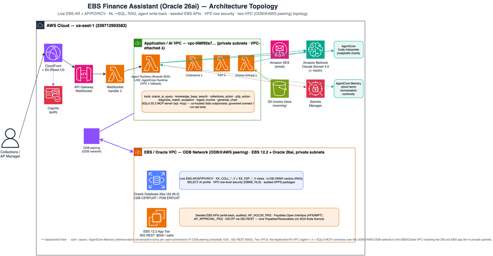
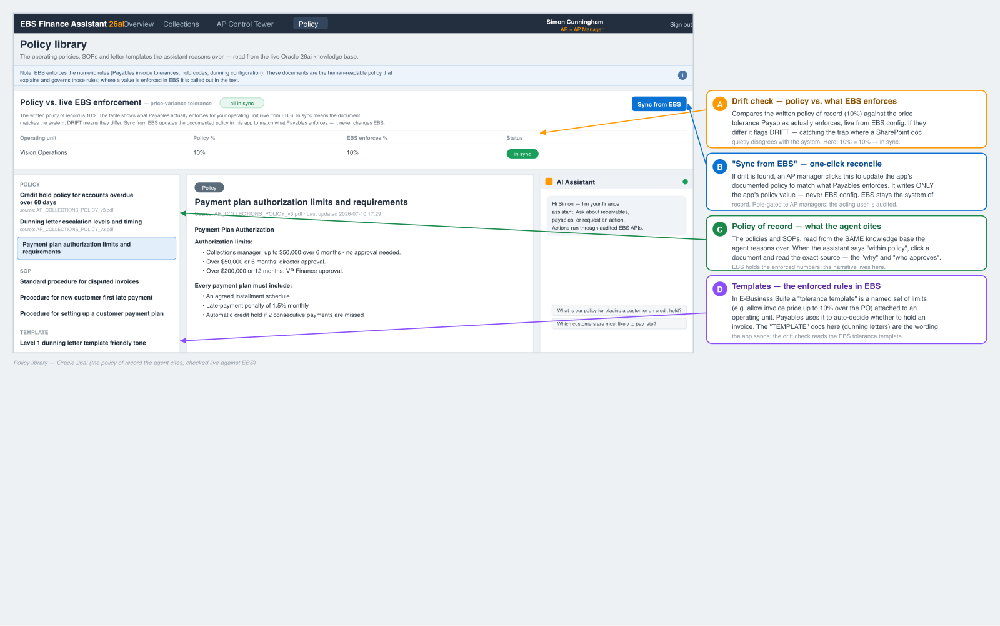

% EBS Agentic AI — Finance
% Working-capital, live and governed, on Oracle 26ai + AWS
% CloudWRXS · AWS Partner briefing

# Ask your ERP anything — and let it act

**One AI assistant on _live_ Oracle E-Business Suite that both answers and acts.**

- Natural-language analytics over live EBS — no data warehouse, no ETL lag
- An agent that *reasons about exceptions* and takes **governed** actions
- Both halves of working capital: **Collections (AR)** + **AP Control Tower (P2P)**
- Built on Oracle Database 26ai native AI + Amazon Bedrock / Strands on AgentCore

::: notes
**What to say (opening, ~60s):** "Every company that runs Oracle E-Business Suite has the same two headaches. First, getting a straight answer out of it is slow — you raise a ticket, someone writes a report, and the data is already a day old. Second, the finance team spends its days manually clearing exceptions: chasing overdue customers and sorting out invoices that are stuck. What we've built is one AI assistant that sits on top of the LIVE system and does both — it answers questions in plain English, and it can actually take action, safely."

**Key terms to ground the room:**
- *Oracle E-Business Suite (EBS)*: Oracle's big ERP — it runs finance, purchasing and accounting. It's the source of truth for the money.
- *Working capital*: the cash tied up in operations — money customers owe US (receivables / cash in) and money WE owe suppliers (payables / cash out). Freeing it up is the whole point.
- *Two sides, one app*: "Collections" = cash-IN (accounts receivable / AR). "AP Control Tower" = cash-OUT (accounts payable / purchase-to-pay / P2P). Same design, two ends of the cash cycle.

**Frame for this audience (CloudWRXS + AWS Partner):** hit both stories — the Oracle side (the AI runs INSIDE the Oracle 26ai database) and the AWS side (the agent runs on Amazon Bedrock and AgentCore). Don't demo yet — set up the problem on the next slide first.
:::

# The problem today

- Analytics comes from **nightly ETL to a data warehouse** → stale, ticket-driven
- Finance teams clear AR collections and AP payables exceptions **by hand**
- **RPA bots** automate only clean cases and break when screens change
- Throughput is capped by human exception-handling; insight is delayed

::: notes
**What to say:** "Here's the way most EBS finance shops work today, and why it's painful."

**Walk the four problems in plain English:**
1. *Stale analytics.* To report on the data, companies copy it every night out of EBS into a separate "data warehouse" (on AWS that's typically Redshift, fed by a copy tool called DMS). That nightly copy is "ETL" — Extract, Transform, Load. Result: every dashboard shows YESTERDAY's data, and any new question needs a developer to build a report.
2. *Manual exception work.* When a customer is overdue, or an invoice doesn't match its purchase order, a human has to investigate and decide. There are thousands of these, so headcount is the ceiling on throughput.
3. *Brittle RPA.* Some shops use "RPA" bots — software that clicks through the screens like a person. It only handles clean, identical cases and breaks the moment Oracle changes a screen. The messy cases still land on a human.
4. *Real cost.* That nightly-copy warehouse stack is ~$2,950/month of AWS spend in our reference build, existing purely to make data reportable. Our approach removes it.

**The nuance for a technical audience:** "We don't drive the screens like RPA. We call Oracle's official APIs and database logic directly, so a screen change can't break us — and the AI actually reasons about the messy exceptions instead of skipping them."
:::

# What we built

- **EBS Finance Assistant** — a single "pane of glass" React app
  - Working-Capital Overview (cash-IN vs cash-OUT)
  - Collections dashboard (AR)
  - AP Control Tower (P2P) with AI invoice ingest
  - Policy library with live policy-vs-EBS drift check
- **Docked AI Assistant on every screen** — analytics, policy, charts, and **audited write-back**
- **Governed by design** — role-based access, read-only DB grants, VPD row security, seeded EBS APIs

::: notes
**What to say:** "So here's what we actually built — one web app, with four screens, and an AI assistant that's always there on the right."

**The four screens (brief — you'll show each shortly):**
1. *Working-Capital Overview* — the home page. Cash coming IN next to cash going OUT, so a finance lead sees the whole picture at once.
2. *Collections (AR)* — the receivables side: who's overdue, who's high-risk, and the actions to chase them (reminders, dunning letters, credit holds).
3. *AP Control Tower (P2P)* — the payables side: where invoices are stuck, why they're on hold, and a drag-and-drop way to feed in a new invoice and let AI read it.
4. *Policy library* — the written rules the AI follows, plus a live check that those rules still match what Oracle enforces.

**Two phrases to emphasise:**
- *"Single pane of glass"*: it's ONE app over the whole cash cycle. The assistant is docked on every screen, keeps the conversation going as you move around, and shows charts in the chat.
- *"Audited write-back"*: the big differentiator vs an ordinary read-only chatbot. Our assistant can actually DO things — place a credit hold, release an invoice hold, send a dunning letter, load an invoice. But every action goes through Oracle's official, logged EBS interfaces, never raw database commands, and only if the user's role allows it. It proposes; a person approves; Oracle records it.
:::

# Architecture at a glance

::: notes
**What to say:** "Let me walk the architecture left to right — it's two private networks that talk to each other, and three simple layers." (A *VPC* is just a private, walled-off network inside AWS.)

**Left — the Application / AI VPC (the app and the brain):**
- The React web UI, delivered via CloudFront (Amazon's content delivery network) and S3 (file storage), with Cognito handling login.
- A WebSocket connection (a live two-way channel between browser and backend) and a small Lambda function (code that runs on demand, no server to manage) that handles those messages.
- The AI agent, built with "Strands" (an AWS agent framework) and hosted on "AgentCore Runtime" (Amazon Bedrock's managed home for agents). It has a memory service so it remembers your conversation, plus a read-only DB query tool (SQLcl MCP).

**Right — the EBS / Oracle VPC (the system of record):**
- Oracle Database 26ai doing four jobs: reporting views (pre-built queries for fast dashboards), in-database vectors for AI knowledge search, VPD for row-level security, and audited packages that perform the actual writes.
- The EBS 12.2 application tier, exposing Oracle's official web APIs (ISG REST).
- The two networks connect over *ODB@AWS* — Oracle Database@AWS, which lets Oracle's database run right next to your AWS workloads on a private, fast link.

**The three layers (say as a pattern):** (1) *Reporting views* for speed — dashboards read pre-built views, so they're instant; (2) *Agent tools* for intelligence — the agent picks the right tool per question/action; (3) *Audited write-back* for safety — every change goes through Oracle's official, logged interfaces.

**One more point:** the agent runs on Bedrock AgentCore Runtime — a VPC-attached container that reaches the private Oracle DB directly, with AgentCore Memory and the bundled SQLcl MCP server.
:::

# The Oracle 26ai difference

| Old way (warehouse) | 26ai native | Benefit |
|---|---|---|
| Redshift + DMS / Zero-ETL | SELECT AI (NL→SQL) on live EBS | No ETL lag, ~$2,950/mo saved |
| No RAG | AI Vector Search (in-DB ONNX) | Policy-grounded answers, no egress |
| App-tier row filtering | VPD in the DB kernel | Agent physically can't over-share |

- Analytics and vector search run **inside the database** — no data leaves EBS for insight
- License-clean: core EBS (AP_HOLDS_PKG, Payables Open Interface, DBMS_RLS, ISG REST) — **no SOA Suite**

::: notes
**What to say:** "This is the slide the Oracle people care about most. The big idea: with Oracle 26ai you do the AI work WHERE THE DATA ALREADY LIVES — inside the database — instead of copying it somewhere else first."

**Explain each 26ai feature in plain English:**
- *SELECT AI (natural language to SQL):* you type a question in English; Oracle turns it into a query, runs it, and returns the answer. No warehouse copy, no waiting for a developer. The old way needed the nightly Redshift/DMS copy — SELECT AI removes it (that's the ~$2,950/month saving).
- *AI Vector Search (how "RAG" works):* RAG = "retrieval-augmented generation" — before answering, the AI retrieves the relevant policy documents so its answer is grounded in YOUR rules, not made up. Oracle 26ai stores those docs as "vectors" (a mathematical fingerprint of meaning) and searches them INSIDE the database using a built-in model (ONNX). Nothing leaves the database for the search — that's the "zero egress" point security teams love.
- *VPD — Virtual Private Database (row-level security):* the database itself filters which rows a user may see, based on who they are. Enforced by the database engine, not the app, so it can't be bypassed. We proved a clerk scoped to one business unit sees only that unit's ~412 rows, not all 25 units' data.

**Honest caveat (only if asked):** on the specific reference clone, SELECT AI's call out to Bedrock hit a known bug in that DB version, so today the English-to-SQL step runs in the agent via Bedrock and flips back to fully in-database with one setting once the DB patch lands. The capability is real; the location of one step is temporary.
:::

# UI — Working-Capital Overview

::: notes
**What to say:** "This is the home screen — the finance leader's view of the whole cash cycle on one page."

**Walk the screen (numbered callouts):**
1. *Cash-IN vs Cash-OUT, side by side.* Left: total overdue that customers owe us (cash to collect). Right: value of invoices we're holding and haven't paid (cash going out). Seeing both together is the point — the health of working capital at a glance. Click either side to drill in.
2. *The recommended action plan.* The "agent runs your day" idea: it ranks the highest-value next moves across BOTH receivables and payables — e.g. "chase this $368M overdue account" or "release this held invoice." Each row is tagged "within policy" (safe) or "needs review" (a human should look). "Act with AI" hands that move to the assistant, which prepares it and waits for your approval before anything happens.
3. *The docked AI Assistant.* On every screen, one live connection, remembers what you've been discussing (AgentCore Memory), and draws charts right in the chat.

**Also point out — the "what-if" simulator:** it projects what would happen to cash and to two standard metrics — *DSO* (Days Sales Outstanding = how long to collect) and *DPO* (Days Payable Outstanding = how long we take to pay) — IF you collected the top overdue and released in-tolerance holds. Stress: it's a projection only; it does the maths, it does NOT move money.
:::

# UI — AP Control Tower (Purchase-to-Pay)

::: notes
**What to say:** "This is the payables side — paying our suppliers — and it's where the 'AI reasons about the messy cases' story really lands."

**Quick grounding:** in Oracle, before an invoice is paid it's "matched" against two things — the purchase order (what we agreed to buy, and at what price) and the goods receipt (what actually turned up). If the price or quantity doesn't line up within allowed limits, Oracle automatically puts it "on hold" — it won't pay until a human sorts it out. This screen is the control room for all those held invoices.

**Walk the screen (callouts A–F):**
- *A. KPI strip* — the headline numbers: invoices in flight, how many on hold, dollar value blocked, awaiting approval, total unpaid.
- *B. Invoice pipeline* — "where do invoices get stuck", Received → Paid. Red drop-offs between stages show exactly where the blockage is. Click a stage to filter the list.
- *C. Blocked value by hold type* — which REASONS tie up the most cash (price, quantity, tax…), so you attack the biggest pile first.
- *D. Payables aging* — how old the held invoices are.
- *E. Exception queue* — the worklist, ranked by dollar value × age. The "Why?" button is the magic: it asks the agent to diagnose that specific hold. Reasoning, not a fixed rule.
- *F. The docked AI Assistant*, same as everywhere.

**What actually happens when you click "Why?" (say this — it's the killer detail):** everything behind the button is READ-ONLY and audited. The agent (1) picks a read-only diagnosis tool, (2) calls an audited Oracle package that reconciles three sources of truth for each invoice line — the invoice (what the vendor billed), the purchase order (what we agreed to buy), and the goods receipt (what actually arrived) — and classifies the mismatch (price too high, billed more than received, billed more than ordered, or no PO at all), (3) does an in-database vector search of your written tolerance policy, and (4) writes one plain-English paragraph with a within-policy / outside-policy verdict. It looks at the PO and the receipt, checks it against your policy, and tells you if releasing is allowed — **but a human still has to approve the actual release.** Nothing is changed just by asking "Why?".

**Invoice ingest (the drag-and-drop):** drop an invoice file in; Amazon Bedrock's vision model READS it (vendor, amount, line items); if confident it stages the invoice straight into Oracle's official loading interface (Payables Open Interface); if not confident it drops into a human review queue — approve, reject, or run the import. If asked: images (PNG/JPEG) work today; PDF needs a small add-on (Amazon Textract).

**The guardrail line:** anything that moves money or releases a hold always waits for a person to approve it. Diagnosis is free and safe; the action is gated.
:::

# UI — Policy library + drift check + sync

::: notes
**What to say:** "This screen answers the question every reviewer asks — 'can we trust the AI?' — and it's a genuine differentiator."

Plain-English grounding for anyone new to EBS:
- A "policy" here is the written rule a finance team follows — e.g. "pay an invoice only if its price is at most 10% over the agreed purchase-order price." It explains the *why* and *who approves*.
- A "tolerance template" in E-Business Suite is how EBS *enforces* that rule as a number — a named set of limits (price 10%, quantity 5%, etc.) attached to an operating unit. When an invoice arrives, Payables checks it against the PO and receipt; inside the limits it flows through, outside them EBS automatically puts it on hold. The template is the switch that decides whether money moves.
- The catch: EBS stores the enforced number, but not the narrative document that explains it. That doc usually lives in SharePoint/PDF, and over time the two drift apart — someone sets the template to 10% but the policy still reads 5%.

What the screen does (the callouts):
A) **Drift check** — reads the tolerance Payables actually enforces (the live EBS template) and compares it to the written policy of record. Same = "in sync"; different = "DRIFT". Catches the compliance trap automatically.
B) **"Sync from EBS"** — when drift is found, an AP manager clicks it to update the app's documented policy to match what EBS enforces. One-way and safe: it writes ONLY the app's own policy value, never EBS config — EBS stays the system of record. Role-gated to AP managers, with a confirmation and an audit of who did it.
C) **Policy of record** — the docs are read from the SAME knowledge base the agent reasons over, so "within policy" is one click to verify the exact source (example on screen: payment-plan authorization thresholds).
D) **Templates** — the "TEMPLATE" group are the dunning-letter templates (the wording the app sends at each escalation level) — distinct from the EBS *tolerance* template, which is the enforcement limit.

Land it: EBS holds the enforced numbers, the app holds the narrative policy, and this screen keeps the two honest — and now reconciles them in one click.
:::

# Security & governance

- **The LLM is never the security boundary** — a deterministic code check runs before any write
- **Identity**: Cognito + server-verified JWT → role-based access (fail-closed)
- **DB least-privilege**: agent's DB account is **read-only on EBS** — zero INSERT/UPDATE/DELETE grants
- **All writes** go through audited seeded PL/SQL packages → EBS public APIs
- **VPD** row-level security in the DB kernel · **KMS** encryption · **all Lambdas in-VPC**
- Agent SQL (SQLcl MCP) is read-scoped and **off by default**

::: notes
**What to say:** "Spend real time on this slide — it's what gets the solution through a customer's security review. The headline: the AI is never the thing that's trusted to make a change."

**The key point explained simply — "the database account has no ability to write":**
When our software connects to Oracle, it logs in with a specific database user account (like a named login with its own permissions). In Oracle you grant permissions per account: SELECT = "allowed to READ", while INSERT / UPDATE / DELETE = "allowed to CHANGE". We deliberately gave the AI's database account ONLY read permission on the finance tables — it was never granted insert, update or delete. So even if the AI (or someone who hijacked it) tried to run a command that changes or deletes financial data directly, the DATABASE ITSELF rejects it — "you don't have permission" — because that account simply lacks the write privilege. It's not a rule in our code that could be bypassed; Oracle enforces it at the account level.

**Which user, exactly (if someone asks):** the account is called **`COLLECTIONS_AI`** — a purpose-built reporting login we created for this app. It is NOT the account that owns the finance data. In EBS the real data is owned by separate Oracle schemas — *AR* (receivables), *AP* (payables), *PO* (purchasing) and *APPS* (the application layer). `COLLECTIONS_AI` was only ever granted SELECT (read) on the specific tables/views it needs from those schemas — no write grants at all. So if it tried to change an invoice row in AP directly, Oracle refuses because the grant doesn't exist. When a real change is needed, `COLLECTIONS_AI` is allowed to EXECUTE a set of audited APPS PL/SQL packages: those run with the APPS owner's privileges (not the AI's), call Oracle's official EBS APIs, and log who did what. The AI can ASK an audited program to make a change, but it can never touch the finance tables itself.

**So how does anything ever change?** Every legitimate change (place/release a hold, send a letter) goes through a separate, locked-down path: pre-written, audited Oracle programs (PL/SQL packages) that call Oracle's own official finance APIs. Those run with their own controlled permissions, log who did what, and are the ONLY way a change happens. The AI can ASK that path to act; it cannot reach around it and touch the tables itself.

**The other guardrails:**
- *Deterministic gate:* before any change runs, a plain piece of code (not the AI) checks "is this user allowed to do this?" The AI suggests; a fixed check decides. In doubt = blocked (fail-closed).
- *Identity:* users log in via Amazon Cognito; the server verifies the login token itself (it doesn't trust what the browser claims). No verified identity = no writes.
- *Roles mirror EBS:* AR managers do AR actions, AP managers do AP actions, analysts are read-only, cross-domain or no-identity is denied. All four tested live.
- *VPD* limits which ROWS each user sees; *KMS* encrypts data at rest; all Lambdas run inside the private network. The AI's own read-only SQL (SQLcl) is scoped and OFF by default.

**Credibility:** verified at the DATABASE level, not by trusting the AI's on-screen "done" (the honest bar). Already through a security review on a sibling project — findings addressed, secrets moved to AWS Secrets Manager, nothing sensitive committed.
:::

# What's real vs roadmap

**Verified live on the reference environment**

- AR + AP dashboards, NL analytics, charts, RAG, audited write-back (credit hold place/release confirmed at DB level)
- Invoice ingest → Payables Open Interface, human-in-the-loop review, VPD, RBAC, policy drift check
- Conversation memory across sessions (AgentCore Memory)

**Roadmap / prerequisite-backed**

- IdP federation (SAML/OIDC) for real end-user identity in EBS audit columns
- PDF invoice extraction (Textract branch); Amazon Quick + GoldenGate integrations (documented runbooks)

::: notes
**What to say:** "I want to be straight about what's actually working versus what's on the roadmap — being candid here builds trust with a technical audience."

**The 'verified live' column — everything here genuinely runs on the reference environment:**
- The AR and AP dashboards, natural-language analytics, charts, and policy-grounded answers (RAG).
- Audited write-back — and we confirmed the credit-hold place/release actually changed the record IN THE DATABASE, not just that the AI said "done." That distinction matters: an AI can wrongly claim success, so the honest test is to check the row — we did.
- Invoice ingest into Oracle's loading interface, the human review queue, row-level security (VPD), role-based access, and the policy drift check.
- Conversation memory that survives across sessions.

**The 'roadmap' column — deliberate scope choices, not things we're hiding:**
- *IdP federation (SAML/OIDC):* wiring login into the CUSTOMER's own identity provider so their real employee IDs land in Oracle's audit columns — needs their identity system, so it's a per-deployment step.
- *PDF invoice extraction:* images work today; PDFs need a small add-on using Amazon Textract.
- *Amazon Quick and Oracle GoldenGate:* separately licensed products with their own setup — runbooks written, just not switched on here.

The message: the core is real and tested; the roadmap items are well-understood, documented, and mostly gated on customer-specific prerequisites.
:::

# Why it matters — and next steps

- **Live** working-capital intelligence, no ETL lag
- The agent **acts** on exceptions through governed, audited APIs — not just a chatbot
- **License-clean, security-reviewed, repeatable** deploy (staged `deploy.sh`, secrets in Secrets Manager)

**Next steps**

- Pilot on a customer EBS clone · scope IdP federation · prioritise PDF ingest + Quick

::: notes
**What to say (closing, ~45s):** "To bring it back to where we started — you can ask your EBS anything, and let it act, live, and it's all governed and secured inside the database."

**Recap the three things that matter:**
- *Live:* no overnight copy, no stale data — answers come straight off the real system.
- *It acts:* not just a chatbot that talks; it takes real finance actions through safe, audited, official Oracle interfaces — with a human approving anything that moves money.
- *Repeatable and safe:* license-clean (core EBS only, no extra Oracle middleware), security-reviewed, and it deploys in stages with all secrets in AWS Secrets Manager — never in the code.

**The ask (be concrete):** "Let's run a pilot on a copy of a customer's EBS environment." Because the deploy is staged and secrets are externalised, standing it up is a configuration exercise, not a rebuild — infra, then the database layer, then the Lambdas, the agent, and the frontend.

**Offer the deeper docs:** Solution Overview, Detailed Design (includes the full security posture write-up), User Guide with the annotated screenshots, and the upgrade runbook.
:::
